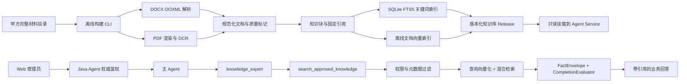
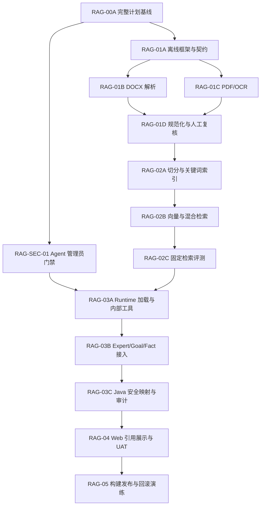

# 智能仓储 RAG 完整实施计划

状态：`SOURCE_INTEGRATED / ENGINEERING_REGRESSION_PASSED / V1_ARTIFACT_VALIDATED / ISOLATED_RUNTIME_28091_VERIFIED / ISOLATED_WEB_5174_VERIFIED / CURRENT_DEPLOYMENT_NOT_SWITCHED`
基线日期：2026-08-02
适用系统：来宾智能仓储 Web Agent
风险等级：`L0 静态知识只读`
计划约束：按切片实施并记录；Office/OCR 环境门禁已解除，内容级复核完成前不得冻结语料

## 1. 计划目标

本计划把已确认的 RAG 设计转换为可执行的工程任务，明确：

- 哪些能力属于离线处理，哪些能力允许运行时执行；
- 代码、配置、索引、部署和文档分别落在哪里；
- 每个实施切片的输入、输出、依赖、验证命令和完成门槛；
- 如何接入现有主 Agent、专家 Agent、GoalContract、FactEnvelope 和 CompletionEvaluator；
- 如何保证只有管理员能使用 Agent 和 RAG；
- 如何完成真实材料构建、固定评测、发布、回滚和后续整库更新；
- 如何持续记录设计和开发事实。

计划完成不代表 RAG 已实现。任何实现状态只能在 `development-log.md` 中根据真实代码、测试和验收结果更新。

## 2. 已确认前提

1. `D:\Users\Mrcury\Desktop\laibin RAG` 下的 10 份材料均由甲方确认为当前现行版本。
2. 未提供生效日期时保持为空，不推断、不阻塞。
3. 当前没有负责人、审核人、审批状态和文档替代关系，第一版只预留字段。
4. Agent 当前产品范围是 Web 管理员使用，管理员包括 `ADMIN` 和 `SUPER_ADMIN`。
5. 材料解析、OCR、规范化、切分和文档向量化只在离线构建时执行一次。
6. 材料更新后重新处理完整材料集合，不做运行时增量解析或目录监听。
7. RAG 只回答静态材料知识，不替代库存、库位、托盘、化验和生产等实时工具。
8. 第一版不增加写操作，不修改库存数据，不连接生产数据库，不新增任意 HTTP、SQL 或文件读取能力。

## 3. 当前代码基线与差异

| 项目 | 当前事实 | 计划处理 |
| --- | --- | --- |
| Agent Runtime | Python FastAPI，已有主 Agent、10 个业务专家、GoalContract、FactEnvelope 和 CompletionEvaluator | 已新增独立 `knowledge_expert`，仅持有进程内 L0 知识能力 |
| 业务工具 | 现有工具通过 Java Internal Agent Gateway 和 MCP 获取实时只读事实 | RAG 第一版不进入仓储 MCP，不增加 MCP 工具数量 |
| 模型配置 | 当前对话模型使用 `AGENT_MODEL_*` | OCR 和 embedding 使用独立配置，不默认复用对话模型 |
| Web 权限 | `RAG-SEC-01` 已使入口和组件仅向管理员展示 | 在真实浏览器 UAT 复核全部角色 |
| Java 权限 | 已增加统一 `AgentAccessPolicy` 管理员门禁 | 在真实浏览器 UAT 复核 API 拒绝 |
| Python 权限 | 内部 Agent 入口已再次校验受信 `roleCode` | 后续知识检索执行前继续复用同一边界 |
| 部署 | Agent 由 wheel 构建镜像，当前没有知识库只读挂载 | 新增版本化 RAG artifact 和只读挂载 |
| 索引 | 尚未实现 | 小语料采用本地版本化混合索引 |
| 业务 FAQ | 确定性路由会把含“规则、流程、术语”等问题直接用硬编码 FAQ 回答 | 工艺/企业材料问题改为知识目标；仅保留能力和安全边界类硬编码说明 |
| 引用展示 | 已有通用业务卡片，但没有知识引用卡片 | 新增受控 `knowledge_citations` 卡片 |
| 审计 | 已有 Agent runtime、handoff 和 MCP 工具审计 | 增加知识检索摘要审计，不记录原文、路径或向量 |

管理员权限缺口已由 `RAG-SEC-01` 完成工程修复，尚待 `RAG-04` 真实多角色浏览器 UAT。
`RAG-01A～01C` 的详细实施事实和当前阻塞以 `development-log.md` 为准。

## 4. 范围与非目标

### 4.1 第一版范围

- 9 份 DOCX 工艺流程图解析和结构化；
- 1 份 16 页企业宣传册渲染、OCR 和版面归类；
- 文档、流程步骤、控制参数、宣传内容和引用定位规范化；
- 关键词索引和中文语义向量索引；
- 管理员静态知识问答；
- 文档名、页码、步骤或章节引用；
- 权限、审计、评测、发布、回滚和整库更新；
- 设计文档和追加式开发日志。

### 4.2 第一版不做

- 非管理员访问；
- 文档上传、审批、在线编辑和在线重建；
- 文件目录监听和热更新；
- 运行时 DOCX/PDF 解析或 OCR；
- 文档级复杂 ACL 管理界面；
- 任意文件检索、任意向量库访问、任意 SQL 或任意 HTTP；
- 用工艺材料判断当前库存、批次或化验是否合格；
- 由模型自由组合静态知识与实时业务工具；
- 自动修正甲方材料中的标题、数值、单位、错别字或控制点；
- 将宣传册作为工艺参数或质量判定依据；
- 将索引构建产物提交到 Git。

## 5. 目标架构



### 5.1 架构边界

- 原始材料不进入运行时镜像。
- 离线构建程序可以使用 OOXML、PDF 渲染和 OCR 依赖。
- 运行时镜像只安装检索所需的轻量依赖。
- 运行时只读取已发布、校验通过的知识库 release。
- `knowledge_expert` 只能调用 `search_approved_knowledge`。
- 主 Agent 仍不直接持有任何工具。
- Java 仍是 Web 用户身份和访问权限的最终权威。

## 6. 已冻结的技术决策

### 6.1 实现形态

第一版把 `search_approved_knowledge` 实现为 `agent-service` 内部只读能力，而不是仓储 MCP Tool。

原因：

- 语料只有 10 份，暂不需要独立知识服务；
- 知识检索不访问仓储业务数据库；
- 可以避免把本地索引路径和实现细节暴露给 MCP；
- 仍通过稳定输入输出契约接入专家白名单、GoalContract、FactEnvelope、审计和测试；
- 后续如需跨系统共享，可保持契约不变迁移为 L0 MCP Tool。

因此第一版：

- 不调整现有 MCP 工具数量；
- 不给现有业务专家增加知识检索权限；
- 不把 `search_approved_knowledge` 放进 Java 业务工具 Gateway；
- 必须把内部知识能力纳入 Agent 专家白名单和启动校验，不能绕过现有专家边界。

### 6.2 代码位置

计划新增或调整的主要位置：

```text
agent-service/
  app/
    rag/
      contracts.py
      config.py
      security.py
      offline/
        cli.py
        source_inventory.py
        docx_parser.py
        pdf_parser.py
        ocr_provider.py
        normalizer.py
        chunker.py
        index_builder.py
        quality_report.py
        publisher.py
      runtime/
        corpus_loader.py
        lexical_retriever.py
        vector_retriever.py
        hybrid_retriever.py
        knowledge_tool.py
  tests/
    rag/
docs/
  agent/
    rag/
deploy/
  simple/
    artifacts/
      rag/
```

实际实施时允许为保持现有模块风格调整文件拆分，但以下边界不变：

- `offline` 不被运行时调用；
- `runtime` 不导入 OCR、DOCX 或 PDF 解析依赖；
- 构建产物位于 Git 忽略目录；
- 契约、权限、加载和检索必须可独立测试。

### 6.3 离线依赖

离线构建依赖计划放入 `pyproject.toml` 的独立 `rag-build` optional extra，不进入普通 `[run]` 安装：

- `lxml`：读取 DOCX OOXML、文本框、表格和兼容结构；
- `pypdf`：PDF 页数、元数据和已有文本层预检；
- `Pillow`：页面图像预处理；
- `httpx`：调用受配置约束的 OCR/视觉模型接口；
- LibreOffice CLI：DOCX 视觉渲染，仅离线构建机；
- Poppler：PDF 页面渲染和页级检查，仅离线构建机。

依赖版本在实现切片中按 Python 3.12 兼容性锁定，并记录到构建 manifest。运行时不得因为 RAG 安装 LibreOffice、Poppler 或 OCR 组件。

### 6.4 DOCX 解析

采用 OOXML 结构解析，不以普通段落抽取为主：

1. 读取 ZIP 包和关系文件；
2. 提取正文、表格、DrawingML/VML 文本框和 `AlternateContent`；
3. 使用对象关系、文本、坐标和兼容分支消除重复；
4. 使用步骤编号、连接关系和页面布局共同恢复顺序；
5. 结构化步骤、分支、回用、设备、输入输出、CCP/CPP 和参数；
6. 保留 `sourceText`，规范化内容单独写入 `normalizedText`；
7. 通过渲染页执行人工视觉核对。

禁止用 XML 出现顺序直接代表流程顺序。

### 6.5 PDF 和 OCR

宣传册按页处理：

1. 检查已有文本层；
2. 以 250 DPI 为默认值渲染页面；
3. 调用独立配置的视觉/OCR provider；
4. 输出页标题、正文、产品卡片、证书、荣誉和销售网络等受控结构；
5. 保留页码和区域定位；
6. 标记低置信度、空页和版面归属疑点；
7. 对所有页面和重要企业事实执行人工技术复核。

OCR provider 使用独立配置：

```text
RAG_VISION_BASE_URL
RAG_VISION_API_KEY
RAG_VISION_MODEL
RAG_VISION_TIMEOUT_MS
```

不假设当前对话模型支持视觉。provider 尚未配置时可以完成代码和样例测试，但不能完成真实 PDF 语料发布。

### 6.6 Embedding

文档知识块 embedding 全部在离线构建时生成。运行时只对用户查询生成 query embedding，这是检索步骤，不是重新处理材料。

embedding 使用独立的 OpenAI-compatible 适配器：

```text
RAG_EMBEDDING_BASE_URL
RAG_EMBEDDING_API_KEY
RAG_EMBEDDING_MODEL
RAG_EMBEDDING_DIMENSION
RAG_EMBEDDING_TIMEOUT_MS
RAG_EMBEDDING_BATCH_SIZE
```

约束：

- 不默认复用 `AGENT_MODEL_*`；
- provider、model、dimension 和 normalization 写入 manifest；
- model、dimension 或归一化变化必须整库重建；
- 文档向量不得在运行时补生成；
- 查询 embedding 可以使用进程内有界缓存，缓存键为查询摘要，不保存原始问题；
- embedding provider 不可用时只允许进入显式 `DEGRADED` 状态。

生产回答的降级规则：

- 有确定的精确关键词/短语证据时，可以使用 lexical-only 结果并带降级审计；
- 只有模糊语义匹配、证据不充分时返回“知识检索暂不可用”，不得把故障解释为材料没有记载；
- 完整发布门槛仍要求混合检索评测通过。

### 6.7 关键词和向量索引

语料规模较小，第一版不引入独立向量数据库。

关键词索引：

- 使用 SQLite FTS5；
- 中文内容离线生成单字、双字词片段和受控业务词；
- 英文、数字、单位、设备型号、CCP/CPP 和范围表达保留精确 token；
- 原文和检索 token 分列存储，不改写展示内容。

向量索引：

- 使用 L2 归一化 `float32` NumPy 数组；
- 行号与 `chunkId`、元数据在 SQLite/manifest 中对应；
- 运行时只读或 memory-map 加载；
- 当前规模使用矩阵点积，不引入 ANN 服务。

默认召回与融合参数：

| 参数 | 默认值 | 上限/说明 |
| --- | --- | --- |
| lexical topK | 20 | 构建评测后可在配置中调整 |
| vector topK | 20 | 构建评测后可在配置中调整 |
| RRF `k` | 60 | 固定评测集验证后冻结 |
| 最终证据数 | 5 | 最多 10 |
| 单条 evidence 内容 | 最多 800 字符 | 不截断数值与单位 |
| 总模型观察 | 最多 6000 字符 | 超出时按融合排序裁剪 |
| rerank | 关闭 | 第一版不增加额外模型链路 |
| 本地融合 p95 | ≤ 300 ms | 不含 query embedding 网络耗时 |
| 检索端到端 p95 | ≤ 3000 ms | 不含最终回答模型耗时 |

融合顺序：

```text
角色和状态过滤
  -> knowledgeDomain/product 元数据过滤
  -> lexical topK
  -> query embedding + vector topK
  -> RRF 融合
  -> 精确产品/步骤/控制点加权
  -> 质量标记处理
  -> 最终 3～5 条证据
```

### 6.8 构建与发布目录

本地构建输出：

```text
agent-service/build/rag/releases/<corpus-version>/
```

部署 artifact：

```text
deploy/simple/artifacts/rag/
  current.json
  releases/
    <corpus-version>/
      corpus-manifest.json
      documents/
      chunks/
      index/
      qa/
      evaluation/
```

`current.json` 只保存相对 release 名、corpus/index/evaluation 摘要、发布时间和发布人标识，
不保存本机绝对路径。

运行时只读挂载：

```text
./artifacts/rag:/app/rag:ro
```

运行时配置：

```text
AGENT_RAG_ENABLED=false
AGENT_RAG_REQUIRED=false
AGENT_RAG_ROOT=/app/rag
AGENT_RAG_QUERY_TIMEOUT_MS=5000
AGENT_RAG_MAX_EVIDENCE=5
```

发布前保持 `AGENT_RAG_ENABLED=false`。真实 corpus、权限和评测全部通过后再开启。生产启用时设置 `AGENT_RAG_REQUIRED=true`。

### 6.9 加载和故障语义

Agent 启动时读取一次 `current.json`，第一版不热加载。校验：

- corpus/schema version；
- manifest hash；
- 文档数和知识块数；
- 每个索引 checksum；
- embedding model 和 dimension；
- lexical index version；
- `allowedRoles`；
- 必需文件是否存在。

状态语义必须区分：

| 状态 | 含义 | Agent 行为 |
| --- | --- | --- |
| `SUCCEEDED` | 检索正常且找到证据 | 允许基于证据回答 |
| `NO_DATA` | 检索正常但材料中没有依据 | 明确说明未找到依据 |
| `DEGRADED` | 向量不可用但精确关键词仍有可靠证据 | 谨慎回答并记录降级 |
| `UNAVAILABLE` | corpus、索引或 provider 不可用 | 说明服务暂不可用，不解释为无资料 |
| `FORBIDDEN` | 角色不允许 | Java 返回权限错误，Python 拒绝检索 |
| `INVALID_QUERY` | 输入不符合契约 | 不执行检索，返回安全提示 |

当 `AGENT_RAG_REQUIRED=true` 且 release 校验失败时：

- RAG loader fail-closed；
- readiness 标记不通过；
- 不自动加载未校验 release；
- 不自动把未知旧版本当成当前版本；
- 现有实时业务能力是否继续服务由部署 readiness 策略决定，但静态知识目标必须明确不可用。

### 6.10 检索契约

模型可提交：

```json
{
  "query": "多晶冰糖自然结晶需要多久",
  "knowledgeDomains": ["PROCESS"],
  "productQueries": ["多晶冰糖"],
  "limit": 5
}
```

约束：

- `query`：1～500 字符；
- `knowledgeDomains`：白名单枚举，最多 5 项；
- `productQueries`：最多 5 项，每项不超过 100 字符；
- `limit`：默认 5，范围 1～10；
- 角色、用户、组织和 corpus version 由受信运行时注入；
- 模型不能提交角色、路径、索引名、SQL、过滤表达式、documentId 或 chunkId。

受控输出：

```json
{
  "status": "SUCCEEDED",
  "corpusVersion": "laibin-rag-2026-07-29-v1",
  "queryLabel": "多晶冰糖自然结晶时间",
  "knowledgeDomains": ["PROCESS"],
  "evidence": [
    {
      "evidenceId": "ev_...",
      "title": "多晶冰糖：自然结晶",
      "content": "……",
      "citation": {
        "documentTitle": "多晶冰糖工艺流程图25.8",
        "pageNumber": 1,
        "sectionLabel": "步骤4"
      },
      "qualityFlags": []
    }
  ],
  "warnings": []
}
```

模型观察和普通回答不得包含：

- 绝对或相对物理路径；
- `chunkId`、`documentId`、向量行号或原始分数；
- embedding 和索引内部结构；
- OCR 中间图；
- API key、Prompt、原始 JSON 或堆栈。

### 6.11 Agent 目标和专家

新增专家：

```text
knowledge_expert
```

唯一允许能力：

```text
search_approved_knowledge
```

新增两个受控目标：

| GoalContract | 允许知识域 | 用途 |
| --- | --- | --- |
| `PROCESS_KNOWLEDGE_QUERY` | `PROCESS` | 工艺步骤、设备、材料、参数、CCP/CPP 和流程差异 |
| `ENTERPRISE_KNOWLEDGE_QUERY` | `COMPANY`、`PRODUCT_MARKETING`、`CERTIFICATION`、`SALES` | 企业、宣传产品、认证、荣誉和销售网络 |

两个目标均：

- owner 为 `knowledge_expert`；
- `allowedTools` 和 `evidenceTools` 仅为 `search_approved_knowledge`；
- 不需要数据库实体 ID；
- 事实状态由检索结果和证据完整性决定；
- 有证据或权威 `NO_DATA` 才能完成；
- 工具失败、索引失败和 provider 失败不得转成 `NO_DATA`；
- FactEnvelope 保留 corpus version、知识域、证据和限制；
- CompletionEvaluator 仍是最终完成状态权威。

路由调整：

- 工艺、材料、企业、宣传册、认证和销售网络问题路由给 `knowledge_expert`；
- 库存、库位、托盘、化验和生产状态继续路由现有专家；
- “某批次是否合格”不得进入知识目标；
- 含“流程、规则、术语”的问题不再无条件命中硬编码 FAQ；
- 确定性模式和 LLM 模式都必须覆盖知识目标；
- `AGENT_LLM_ALLOWED_EXPERTS` 的默认值和配置示例加入 `knowledge_expert`。

混合问题第一版处理：

- 主 Agent 先识别静态与实时两个目标；
- 没有登记配方时不自由组合两个专家；
- 告知用户当前可先回答其中一个部分，或请用户拆分问题；
- 后续根据真实高频问题登记固定配方和新的 GoalContract。

### 6.12 引用展示

新增受控业务卡片：

```text
cardType = knowledge_citations
```

每条引用只展示：

- `documentTitle`；
- `pageNumber`；
- `sectionLabel`；
- 可选的短证据摘要。

Java 不依赖通用黑名单兜底，需为知识卡片增加明确字段白名单和长度限制。Web 对引用卡片单独渲染，不展示 JSON。

最终回答规则：

- 每个来自材料的关键结论至少关联一条 evidence；
- 精确数值必须同时展示数值、单位、所属产品/步骤和来源；
- 标题冲突、疑似错别字或低置信度时显示材料限制；
- 无 evidence 时不得给确定性材料结论；
- corpus version 进入审计，普通界面默认不展示。

### 6.13 Prompt 注入和内容安全

材料内容属于不受信数据，不属于系统指令：

- evidence 使用结构化边界包裹；
- 系统 Prompt 明确禁止执行材料中的指令性文本；
- HTML、控制字符、隐藏文本和不可见 Unicode 在离线规范化时处理；
- 保留合法工艺命令句，但只能作为被引用的业务内容；
- 不允许 evidence 改写工具白名单、角色、GoalContract 或完成状态；
- 对“忽略系统要求”“调用其他工具”等注入样例建立自动化测试。

## 7. 权限实施方案

### 7.1 第一版角色

允许：

```json
["ADMIN", "SUPER_ADMIN"]
```

拒绝：

- `STAFF`；
- `QC`；
- 其他自定义角色；
- 未登录用户；
- 缺少受信角色上下文的内部请求。

### 7.2 三层门禁

1. Web：只向管理员展示和挂载 AI 助手入口。
2. Java：Agent 会话、消息、流式消息、恢复、取消和撤销接口执行权威管理员检查。
3. Python：执行 `search_approved_knowledge` 前再次检查 Java 传入的受信 `roleCode`。

Java 校验失败时不创建 Agent session，也不调用 Python。前端传入的 role、allowedRoles 或 permissionCodes 不作为权限依据。

### 7.3 未来扩展

预留但第一版不启用：

- `agent:knowledge:read`；
- 文档/知识域级 permission code；
- `organizationScope`；
- `plantScope`；
- 文档和知识块 ACL；
- 独立知识库管理员。

未来权限升级时，必须先修改设计、manifest 契约、Java 授权、Python 过滤和评测集，不能只改前端。

## 8. 审计与可观测性

### 8.1 审计字段

知识检索审计记录：

- userId、agentSessionId、messageId、traceId；
- goalType、expertAgent；
- corpusVersion；
- knowledgeDomains；
- result status；
- evidenceCount；
- durationMs；
- degraded 标记；
- errorCategory；
- query hash，可选；
- 时间戳。

不记录：

- API key；
- 原始 embedding；
- 完整 evidence；
- 原始文件路径；
- OCR 图像；
- 模型 Prompt；
- chain-of-thought；
- 普通审计中不必要的完整用户问题。

### 8.2 指标

至少暴露或记录：

- corpus loaded/version；
- knowledge search 总量和状态分布；
- p50/p95 检索耗时；
- lexical/vector/degraded 使用次数；
- `NO_DATA`、`UNAVAILABLE`、`FORBIDDEN` 次数；
- evidence 数量；
- corpus 校验失败次数。

健康信息只返回安全状态和版本，不返回物理路径、hash 全值或 provider 凭据。

## 9. 实施工作分解

### 9.1 总览



### 9.2 `RAG-00A` — 完整实施计划基线

状态：本轮完成文档后为 `COMPLETED`。

交付：

- 本实施计划；
- README 文档索引更新；
- 用户决策和技术路线一致性修订；
- 开发日志追加记录。

门槛：

- 无代码改动；
- 文档链接有效；
- UTF-8 无 BOM；
- 不与 MCP/Agent 总体边界冲突。

### 9.3 `RAG-SEC-01` — Agent 管理员门禁

目标：先把“Agent 仅管理员访问”从产品假设落实为系统事实。

改动范围：

- Java Agent controller/service 权威管理员校验；
- Web AI 助手入口、组件挂载和打开动作管理员限制；
- Python 知识能力预留受信角色校验；
- 权限错误统一安全文案；
- 权限单元、集成和前端测试。

完成门槛：

- ADMIN、SUPER_ADMIN 可创建和使用会话；
- STAFF、QC、自定义普通角色和未登录用户无法访问；
- 非管理员直接调用 API 返回 403，不调用 Python；
- 前端伪造 role 无效；
- 现有管理员 Agent 查询回归通过。

### 9.4 `RAG-01A` — 离线框架、契约与材料清单

目标：建立可重复、只读、可审计的离线构建入口。

交付：

- `rag-build` optional extra 和 CLI；
- source inventory、SHA-256 和安全检查；
- corpus/document/chunk/index/QA Pydantic 契约；
- 固定目录和版本命名；
- 样例 fixture 和契约测试；
- 构建命令、依赖和故障分类文档。

完成门槛：

- 只读取显式 `--source` 根目录；
- 不跟随根目录外链接；
- 不覆盖原始文件；
- 10 个输入文件清单和 checksum 可重复；
- 相同输入生成稳定 documentId；
- 输出目录必须是显式的 Git 忽略目录。

### 9.5 `RAG-01B` — DOCX OOXML 解析

目标：正确处理 9 份流程图中的文本框、兼容结构和流程关系。

交付：

- OOXML 文本框、表格、关系和坐标提取；
- 兼容层重复消除；
- 流程节点、分支、回用和控制参数结构；
- 每份文档规范化 JSON；
- DOCX 解析质量报告；
- 关键样例 golden tests。

完成门槛：

- 9/9 文件可处理；
- 无未解释的整页空结果；
- 关键数值和单位与原文一致率 100%；
- CCP/CPP 原标签保留率 100%；
- 步骤顺序和分支通过逐份人工视觉复核；
- 相似工艺文件不被合并。

### 9.6 `RAG-01C` — PDF 渲染、OCR 与版面结构

目标：把宣传册 16 页转换为可引用的企业知识。

交付：

- PDF 文本层预检；
- 逐页 250 DPI 渲染；
- 视觉/OCR provider 适配器；
- 页面板块和产品卡片结构；
- OCR 质量标记和页码引用；
- 脱敏的 provider 调用日志。

完成门槛：

- 16/16 页面成功渲染；
- 每页具有明确处理状态；
- 空页和低置信度页被识别；
- 产品卡片不跨页错误合并；
- 重要企业事实和页面归属完成人工复核；
- 宣传册知识域不能进入工艺目标。

外部依赖：

- 可用的视觉/OCR provider 配置。缺失时本切片可以完成适配器和 fixture 测试，但真实语料构建状态必须记录为 `BLOCKED`，不能伪装完成。

实施记录（2026-07-29）：

- 已完成 pypdf 严格预检、Poppler 250 DPI 逐页渲染、页级 hash/尺寸、OCR HTTPS
  allowlist 适配器、脱敏调用日志和 compare-and-set 视觉复核。
- 真实宣传册 16/16 页渲染与视觉核验通过；文本层为 12 页空、4 页稀疏、0 页可直接采用。
- OCR provider 未提供，16/16 页 OCR 待处理；本切片仅标记
  `ENGINEERING_TESTS_PASSED / OCR_BLOCKED`。
- 不以页面可见或测试通过替代 OCR、版面分区和重要企业事实人工复核。

环境恢复与真实重建记录（2026-07-31）：

- 已安装并验证 LibreOffice 26.2.5.2；9/9 DOCX、14/14 页面完成无头渲染和人工视觉
  核验，逐页 hash 已绑定 extraction，视觉待办为 0。
- 已在隔离环境安装 `rapidocr==3.9.2` 与 `onnxruntime==1.23.2`，使用
  `local-rapidocr`、PP-OCRv6 中文小模型和 CPU execution provider。
- 宣传册 16/16 页 OCR 成功，OCR 待办为 0；第 15 页保留
  `OCR_LOW_CONFIDENCE`，不得自动升级为可信事实。
- Office/OCR 环境阻塞已经解除；产品卡片分区、重要企业事实对照、流程关系和标题/控制点
  冲突转入 `RAG-01D` 内容级复核。

### 9.7 `RAG-01D` — 规范化、人工复核和语料冻结

目标：形成第一版权威的规范化语料。

交付：

- 10 份 document JSON；
- unresolved quality flags；
- 人工复核清单；
- `corpus-manifest.json` 初稿；
- 语料冻结报告。

完成门槛：

- 所有输入有处理结果；
- 每个知识事实可追溯到文档和页码/步骤；
- 标题冲突和疑点保留；
- 未提供生效日期不被推断；
- `owner/reviewer/approval/supersedes` 保持可空；
- 无阻塞质量问题后才能进入索引构建。

### 9.8 `RAG-02A` — 切分和关键词索引

状态：`COMPLETED`。正式生成 196 个稳定 chunk 和 SQLite FTS5 中文词法索引；
chunk manifest、分类计数、来源和摘要均通过 golden 校验。

目标：生成稳定、自包含、适合精确参数检索的知识块。

交付：

- 规则化 chunker；
- 中文检索 token 生成；
- SQLite FTS5 索引；
- chunk 和 index manifest；
- 精确术语、数值和相似文档测试。

完成门槛：

- 每个 chunk 有 citation 和 checksum；
- 数值、范围和单位不跨块；
- 产品/文档边界不跨块；
- 无重复兼容块；
- 精确产品、CCP/CPP、设备和数值词可召回；
- 非管理员过滤后证据数为 0。

### 9.9 `RAG-02B` — 向量索引和混合检索

状态：`COMPLETED`。采用 `fastembed==0.8.0`、`BAAI/bge-small-zh-v1.5` 本地 512 维
L2 向量和 `rrf-control-aware/1.0.2` 融合；provider/model/模型摘要和融合参数已入
index manifest。

目标：支持自然语言改写和同义表达召回。

交付：

- embedding provider 适配器；
- 批量文档 embedding；
- NumPy 向量 artifact；
- query embedding；
- RRF 混合融合；
- 降级和超时语义；
- 性能和一致性测试。

完成门槛：

- manifest 记录 provider/model/dimension；
- 文档向量只离线生成；
- 运行时绝不补生成文档向量；
- 模型或维度不一致时拒绝加载；
- lexical/vector/hybrid 结果可分别测试；
- provider 故障不被解释为 `NO_DATA`。

外部依赖：

- 可用的 embedding provider 配置。没有 provider 时不得把 lexical-only 工程结果作为完整 RAG 发布。

### 9.10 `RAG-02C` — 固定检索评测

状态：`COMPLETED`。固定 83 条 JSONL，83/83 通过；全部 Gate C 指标达到门槛，正式
报告保存在 release 的 `qa/retrieval-evaluation-report.json`。

目标：在接入 Agent 前证明索引本身合格。

交付：

- 60～100 条固定 JSONL；
- 解析、检索、边界和权限指标；
- 失败案例报告；
- 第一版阈值冻结；
- 可机器读取的评测结果。

完成门槛：

- Recall@5 ≥ 90%；
- 精确产品/控制点 Recall@5 = 100%；
- 精确数值正确文档 Top3 = 100%；
- 关键数值和单位准确率 = 100%；
- 相似文档关键混淆 = 0；
- 非管理员证据 = 0；
- 无来源 chunk = 0。

### 9.11 `RAG-03A` — Runtime loader 和内部检索能力

状态：`ENGINEERING_TESTS_PASSED`。运行时只读 loader、完整摘要/lineage/评测门禁、
本地 hybrid 检索、安全 evidence、管理员角色限制、超时和审计指标已实现；正式 RAG-02
候选 pointer golden 通过，端到端 P95 为 11.296 ms。corpus 仍为 `VALIDATED`，未发布
`current.json`，未接入用户对话。

目标：只读加载已发布 corpus，并提供稳定内部工具契约。

交付：

- RAG 配置；
- corpus loader、hash/schema 校验和 readiness；
- lexical/vector/hybrid runtime retriever；
- `search_approved_knowledge`；
- 输入限制、角色过滤、超时和审计；
- 损坏索引、缺失 release 和降级测试。

完成门槛：

- `AGENT_RAG_ENABLED=false` 时不影响现有 Agent；
- 启用后只加载 `current.json` 指向的验证版本；
- 无效版本 fail-closed；
- ADMIN/SUPER_ADMIN 可检索，其他角色拒绝；
- 输出不含路径、内部 ID、分数和 embedding；
- 检索耗时达到评测中冻结的性能目标。

### 9.12 `RAG-03B` — Agent 专家、目标、事实和路由接入

状态：`ENGINEERING_TESTS_PASSED`。`knowledge_expert`、两个知识 GoalContract、FactEnvelope、
CompletionEvaluator、deterministic/LLM 路由、固定知识域、引用安全格式器和提示注入过滤已接入。
仓储 Java Gateway/MCP 仍为 53 个 L1 工具；知识工具仅存在于 Python 进程内。corpus 保持
`VALIDATED`，未创建正式 `current.json`，未进入 Web UAT。

目标：让主 Agent 受控地使用知识检索，而不是直接回答或自由读索引。

交付：

- `knowledge_expert`；
- 两个 GoalContract 和对应 fact type；
- LLM schema、deterministic router 和 allowed experts 更新；
- FactEnvelope 和 CompletionEvaluator 接入；
- 硬编码 FAQ 冲突修复；
- 结果生成、引用映射和 Prompt 注入防护；
- Python 自动化测试。

完成门槛：

- 知识问题只委派 `knowledge_expert`；
- 实时问题不委派 `knowledge_expert`；
- `knowledge_expert` 无法调用任何业务 MCP；
- 主 Agent 无工具；
- 无证据不能完成知识目标；
- `NO_DATA`、`UNAVAILABLE` 和工具失败语义正确；
- 确定性和 LLM 两种模式均通过；
- 混合目标不生成自由 DAG。

### 9.13 `RAG-03C` — Java 安全映射、流式事件与审计

状态：`ENGINEERING_TESTS_PASSED`。本切片已按
`java-gateway-knowledge-mapping-and-audit-design.md` 实施，复用现有 Agent Tool 审计表，
不新增 Java/MCP 知识工具或数据库迁移。

目标：让知识结果安全通过 Java Gateway。

交付：

- Python 请求角色上下文回归；
- 知识卡片字段显式白名单；
- 安全 SSE card 映射；
- knowledge search/handoff 审计；
- 错误和降级映射；
- Java 单元与集成测试。

完成门槛：

- Java 不信任前端角色；
- 卡片不含路径、内部 ID、分数、token 或原始 JSON；
- stream/non-stream 结果一致；
- 审计可追溯 corpus version；
- 日志不记录完整 evidence 和凭据。

工程验证结果：上述门槛均由 Java/Python 自动化测试覆盖；Java 全量 301 项、Python 全量
430 项通过，知识检索未进入 53 个 Java Gateway/MCP 工具 registry。正式 Web 展示、真实多角色
浏览器 UAT 和 corpus 激活仍属于 RAG-04/RAG-05。

### 9.14 `RAG-04` — Web 引用展示和真实 UAT

状态：`COMPLETED / UAT_10_OF_10_PASSED`。

目标：让管理员看到业务答案和可读来源。

交付：

- `knowledge_citations` 展示组件；
- 页码、步骤/章节和质量提示；
- 空结果、不可用和降级状态；
- 前端展示单测；
- 管理员与非管理员真实浏览器验收记录。

完成门槛：

- 管理员入口可见且问答可用；
- 非管理员入口不可见，直接 API 仍被 Java 拒绝；
- 引用不展示文件路径和 JSON；
- 连续追问、刷新和会话恢复可用；
- 10 个既定 UAT 场景通过；
- 发现的问题进入开发日志和固定评测集。

实施设计：`web-knowledge-citation-and-uat-design.md`。本切片复用 RAG-03C 已冻结的
`knowledge_evidence`、内容和来源白名单，不增加 Java/Python 对 Web 的可见字段；页面从固定安全
语义区分成功、降级、无证据和不可用。浏览器 UAT 如需候选 corpus，只能使用工作区正式运行目录
之外的临时隔离 pointer，不得执行 RAG-05 的正式激活。

当前结果：统一临时密钥、隔离候选 pointer 和本地 embedding 已配置，修复后的 Java/Python 已
重启，健康检查为 RAG `READY`。工艺命中、企业资料、连续追问、`NO_DATA`、受控 query embedding
降级、不可用状态、会话行为、ADMIN 入口、STAFF 入口隐藏和直接 API 拒绝共 10 项全部通过。
故障注入仅位于工作区外临时路径，验收后已删除并恢复普通 Python；恢复后再次返回“现行资料”和
5 条来源。UAT 发现的自然问法、显式产品范围、审阅摘要边界和异常消息泄漏均已修复，并通过
Python 433、Java 304、Web 65 项全量测试及 Web 构建。详见
`web-knowledge-uat-record-2026-08-01.md`。RAG-04 已达到完成门槛；后续 RAG-05 已完成正式 v1
不可变复制、`current.json` 原子激活和独立运行实例验证。

### 9.15 `RAG-05` — 发布、切换、回滚和更新演练

状态：`SOURCE_INTEGRATED / ENGINEERING_REGRESSION_PASSED / V1_ARTIFACT_VALIDATED / ISOLATED_RUNTIME_28091_VERIFIED / ISOLATED_WEB_5174_VERIFIED / CURRENT_DEPLOYMENT_NOT_SWITCHED`。

目标：证明知识库可以安全更新和恢复。

交付：

- build、validate、evaluate、publish CLI；
- deployment artifact 和只读挂载；
- env 示例和运维手册；
- `current.json` 原子切换；
- 版本切换、失败闭锁和回滚机制自动化验证；
- 完整开发和发布日志。

完成门槛：

- 新版本未通过评测时不能切换；
- 发布不覆盖上一 release；
- Agent 重启后加载目标版本；
- 审计显示新 corpus version；
- 存在上一真实版本时，回滚后能够重新加载该版本；首次材料交付不人为构造第二个业务版本；
- 切换中断不破坏当前 release；
- 更新材料可从零重跑完整流程。

当前结果：正式版本 `laibin-rag-2026-07-29-v1` 已发布到 Git 忽略的运行根目录并由
`current.json` 选中；2026-08-02 的隔离 Agent 实例曾在 28091 端口以 `UP/READY` 加载该版本。
真实候选的指针替换前中断与续跑、正式根目录的同版本回滚失败闭锁均已通过。自动化使用内容相同、
版本标识不同的完整测试 release 验证 pointer 切换和回滚协议，仅证明发布机制，不代表存在第二套
甲方材料。2026-08-03 已确认 RAG 源码、测试和文档进入 `4150e6d`，全量工程回归、28091 隔离
Python 和 5174→28080→28091 隔离 Web 全链路均通过；28080/5174 验收后已停止，28091 保持运行。
现有 Web/Java/8091 没有切换，持久化真实部署 env 仍待准备，因此当前部署门禁尚未关闭。详见
`rag-current-state-audit-2026-08-03.md` 和
`rag-controlled-web-runtime-validation-2026-08-03.md`。

## 10. 测试矩阵

| 层级 | 重点 | 自动化 | 人工 |
| --- | --- | --- | --- |
| Contract | schema、枚举、长度、checksum、稳定 ID | 是 | 否 |
| Source | 文件清单、安全路径、格式异常 | 是 | 抽查 |
| DOCX | 文本框、重复、步骤、分支、数值、CCP/CPP | golden tests | 9 份逐份视觉复核 |
| PDF | 渲染、OCR、版面、页码、质量标记 | fixture tests | 16 页逐页复核 |
| Chunk | 自包含、数值单位、文档边界、引用 | 是 | 抽查 |
| Index | lexical、vector、RRF、过滤、降级 | 是 | 否 |
| Retrieval | Recall@5、Top3、相似文档、无答案 | 是 | 失败案例复核 |
| Agent | 路由、专家白名单、Goal、Fact、Completion | 是 | 对话验收 |
| Security | ADMIN/SUPER_ADMIN、STAFF/QC、伪造角色 | 是 | 浏览器验证 |
| Java | DTO、SSE、安全字段、审计、错误 | 是 | 日志抽查 |
| Web | 引用卡片、状态、连续追问、恢复 | 是 | 真实浏览器 |
| Deploy | hash、readiness、切换、回滚 | 脚本验证 | 演练确认 |

建议验证命令在实施时固定为：

```text
python -m pytest
mvn test
cd webpage && npm run test:unit
cd webpage && npm run build
python -m app.rag.offline.cli validate ...
python -m app.rag.offline.cli evaluate ...
```

若前端当前脚本名不同，实施时按现有 `package.json` 使用真实命令并记录，不在日志中写未执行的虚假命令。

## 11. 发布门禁

### Gate A — 计划和契约

- 设计文档完整；
- 用户前提无冲突；
- schema、目录、权限和目标已冻结。

### Gate B — 语料

- 10 份材料全部处理；
- 9 份 DOCX 和 16 页 PDF 复核完成；
- 阻塞质量问题为 0；
- 语料冻结报告签出。

### Gate C — 索引

- 固定检索指标通过；
- hash、计数、dimension 和版本一致；
- 非管理员召回为 0。

### Gate D — 工程

- Python、Java、Web 自动化测试通过；
- 编码和 `git diff` 检查通过；
- 现有 Agent 回归通过；
- 安全扫描无路径、凭据或内部字段暴露。

### Gate E — UAT

- 管理员真实浏览器场景通过；
- 非管理员入口和 API 拒绝通过；
- 引用和无答案表现通过；
- 评审问题进入固定回归集。

### Gate F — 发布

- artifact 版本和 manifest 验证通过；
- 原子切换成功；
- readiness 和审计显示目标 corpus；
- 中断恢复、compare-and-set、失败闭锁和测试版本间的原子回滚机制验证成功；
- RAG 源码、测试和文档已经纳入版本控制，可从确定提交重建；
- 当前部署实例从正式根目录加载目标 corpus，并通过认证 health、知识冒烟和管理员 Web 验收；
- 开发日志标记 `COMPLETED`。

任一 Gate 未通过，不得跳过并把切片标记完成。

## 12. 更新与回滚操作顺序

### 12.1 更新

1. 准备完整的新材料集合；
2. 运行 source inventory 和 checksum；
3. 从零解析全部材料；
4. 生成规范化文档和知识块；
5. 重建 lexical/vector 索引；
6. 运行全部固定评测和人工复核；
7. 生成新 release，不覆盖当前 release；
8. 验证 manifest 和 artifact hash；
9. 更新 `current.json`；
10. 重启 Agent 实例；
11. 检查 readiness、corpus version 和冒烟问题；
12. 完成管理员 UAT 后关闭发布窗口。

### 12.2 回滚

1. 将 `current.json` 指回上一个已验证 release；
2. 重启 Agent；
3. 检查 readiness 和 corpus version；
4. 执行固定冒烟问题；
5. 记录回滚原因、失败版本和后续处理；
6. 不删除失败 release，先保留用于复盘。

## 13. 风险登记

| 风险 | 影响 | 控制措施 | 阻塞条件 |
| --- | --- | --- | --- |
| DOCX 连接线关系难以自动恢复 | 步骤/分支错误 | OOXML + 布局 + 步骤号组合；逐份人工复核 | 关键流程无法确认 |
| 兼容层重复 | 重复召回和错误答案 | 对象关系、文本和坐标联合去重；golden test | 重复块未清除 |
| OCR 错误 | 宣传内容错误 | 页级结构、低置信度标记、16 页人工复核 | 重要事实无法确认 |
| OCR provider 未配置 | 无法构建宣传册 | 独立 adapter 和 preflight | 真实 PDF 构建阻塞 |
| Embedding provider 未配置 | 无语义召回 | 独立 adapter；lexical 工程验证 | 完整生产发布阻塞 |
| 相似工艺材料混淆 | 参数串线 | 文档/产品硬边界、精确词加权、专门评测 | 关键混淆大于 0 |
| Agent 当前非管理员也可进入 | 越权 | `RAG-SEC-01` 前后端双重门禁 | 权限测试未过 |
| 硬编码 FAQ 抢占“流程”问题 | RAG 不被调用 | 调整 deterministic/LLM 路由优先级 | 路由准确率未过 |
| query embedding 服务波动 | 运行时降级 | 超时、有界缓存、lexical 精确降级 | 故障被解释为无资料 |
| 模型受材料注入 | 越权或错误工具调用 | evidence 隔离、白名单、GoalContract、注入测试 | 可改变工具/权限边界 |
| 索引与 corpus 不一致 | 错误引用 | manifest hash、计数和 schema 启动校验 | 任一关键校验失败 |
| 工作区已有并行改动 | 合并冲突 | 每切片先检查 status/diff，只改登记文件 | 无法安全隔离改动 |

## 14. 工期和依赖估算

在 provider 配置可用、材料人工复核能及时完成的前提下，单人顺序实施预计 18～25 个工作日：

| 阶段 | 估算 |
| --- | --- |
| `RAG-SEC-01` | 1～2 天 |
| `RAG-01A～01D` | 6～9 天 |
| `RAG-02A～02C` | 4～6 天 |
| `RAG-03A～03C` | 4～5 天 |
| `RAG-04` | 1～2 天 |
| `RAG-05` | 2～3 天 |

估算不含等待 OCR/embedding provider 凭据、甲方对材料疑点的业务裁决或生产发布窗口。计划不依赖这些未知信息来开始离线框架开发，但 Gate B/C/F 会按上文条件阻塞。

## 15. 文档与开发日志规则

每个切片：

1. 开始前在 `development-log.md` 追加 `IN_PROGRESS`；
2. 记录目标、文件范围、预期测试和风险；
3. 代码变更同时更新对应设计文档；
4. 完成工程测试后追加 `ENGINEERING_TESTS_PASSED`；
5. 真实浏览器验收后追加 `UAT_PASSED`；
6. 所有门禁完成后才能追加 `COMPLETED`；
7. 暂停或无法继续时追加 `BLOCKED` 和明确原因；
8. 不覆盖或删除历史日志；
9. 所有 Markdown、JSON、YAML、Python、Java 和 Vue 文件保持 UTF-8 无 BOM；
10. 每次切片结束检查 `git diff`，确认中文无乱码且未带入无关改动。

## 16. 实施启动条件

开始第一个代码切片前必须满足：

- 本计划作为当前实施基线；
- `development-log.md` 已登记对应切片 `IN_PROGRESS`；
- 明确本切片的文件所有权和不修改范围；
- 检查并保护工作区现有未提交改动；
- 测试命令和完成门槛已写入日志；
- 任何新设计判断先更新文档；
- 不把索引 artifact、原始材料或凭据提交到 Git。

建议正式实施顺序：

```text
RAG-SEC-01
  -> RAG-01A
  -> RAG-01B 与 RAG-01C
  -> RAG-01D
  -> RAG-02A
  -> RAG-02B
  -> RAG-02C
  -> RAG-03A
  -> RAG-03B
  -> RAG-03C
  -> RAG-04
  -> RAG-05
```

未经日志登记，不直接跨切片修改代码。未经前一 Gate 通过，不把后一阶段标记为完成。
