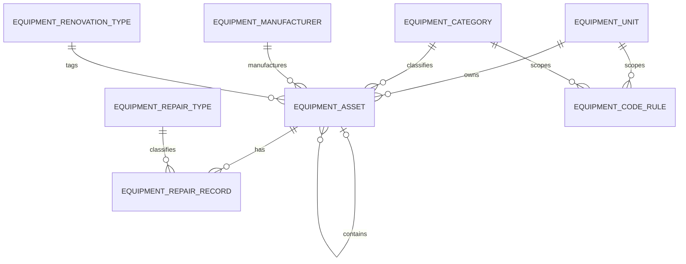

# 设备管理模块分析与设计

> 日期：2026-08-26  
> 依据：甲方提供的《设备管理系统（单机版 V1.0.3.5）》、其 Paradox 数据文件、帮助文档、FastReport 报表模板，以及当前冰糖生产与仓库管理系统代码  
> 文档状态：需求边界已收敛，待甲方确认少量遗留字段含义后可进入开发

## 1. 结论

本次工作不是复刻 2003 年 Windows 单机程序，而是把其中仍有业务价值的字段、字典、编号规则和数据关系迁入现有系统。

新模块应遵循当前项目的统一实现方式：

- 后端使用 Spring Boot、MyBatis-Plus、DTO/PO/VO 分层、`Result<PageResult<VO>>` 分页格式；
- 前端使用 Vue 3、Element Plus、现有菜单、路由、表格、表单和权限按钮风格；
- 使用现有 JWT、Spring Security、RBAC 和 `@LogOperation`，不迁移旧程序的用户、密码或登录日志；
- 设备编号由后端按旧系统规则自动生成，并以数据库唯一约束和事务锁保证不重复；
- 旧程序的“附属设备”不再复制一张结构相同的表，改为设备表的自关联；
- 旧程序报表以当前系统的列表、详情和 Excel 导出呈现，不复刻 FastReport 或打印窗口。

### 1.1 本期范围

1. 设备台账；
2. 附属设备关系；
3. 生产厂家；
4. 设备单位；
5. 设备类别；
6. 技改类别；
7. 修理类型；
8. 修理记录；
9. 设备编号自动生成；
10. 设备、厂家和修理记录查询及导出。

### 1.2 明确不在本期范围

- 巡检任务、点检标准和扫码巡检；
- 故障上报、维修工单、派工和审批流程；
- 保养计划、保养提醒和定时任务；
- 备件、领料和库存联动；
- IoT、运行时长、能耗和在线状态；
- 设备折旧、财务核算和采购合同；
- 文件附件、照片库和视频管理；
- 新建独立的设备用户、角色或登录系统；
- 对旧程序界面、菜单布局、安装包和报表设计器的像素级复刻。

## 2. 分析依据与可信度

### 2.1 已检查材料

- 运行并截图旧程序主界面和设备台账；
- 读取旧程序内置帮助，确认设备编号规则；
- 检查安装目录中的 Paradox/BDE 表名和字段定义；
- 解析 FastReport 报表模板，核对设备、厂家和修理记录打印字段；
- 检查 Delphi 程序资源中的表关系、查询和表单组件；
- 检查当前项目的后端分层、权限、操作日志、分页格式、前端技术栈和数据库风格。

旧程序截图见：[设备台账截图](../../output/equipment-template-analysis-20260826/08-ledger-window.png)。

### 2.2 功能证据

| 业务对象 | 旧程序证据 | 结论 | 可信度 |
|---|---|---|---|
| 设备台账 | 主界面、`Sb.DB`、设备卡/明细报表 | 必须实现 | 高 |
| 附属设备 | `fsSB.DB`，按 `Fssbid` 与主设备形成主从关系 | 用设备表自关联实现 | 高 |
| 生产厂家 | 厂家表单、`Sbsccj.DB`、厂家卡/明细报表 | 必须实现 | 高 |
| 修理记录 | 修理表单、`Xljl.DB`、多份修理报表 | 必须实现 | 高 |
| 设备单位 | `Dwmc.DB`、设备选择框、编号帮助 | 模块内基础字典 | 高 |
| 设备类别 | `Lbmc.DB`、设备选择框、编号帮助 | 模块内基础字典 | 高 |
| 技改类别 | 台账界面、`jglx.DB` | 模块内基础字典 | 高 |
| 修理类型 | `xllx.DB`、修理记录选择框 | 模块内基础字典 | 高 |
| 编号生成 | 帮助文档、类别表编号区间字段、程序查询字符串 | 必须由服务端实现 | 高 |
| 用户及登录日志 | `Password.DB`、`user.DB` 等 | 不迁移，使用现有 RBAC | 高 |

## 3. 旧程序字段盘点

以下仅把旧字段作为业务证据。新库采用可读的 `snake_case` 字段名，不沿用拼音缩写。

### 3.1 设备台账

| 旧字段 | 旧界面/报表名称 | 新字段 | 建议类型 | 规则 |
|---|---|---|---|---|
| `SBID` | 内部主键 | `id` | `int` | 新库自增主键 |
| `SBBGCC` | 设备编号 | `equipment_code` | `varchar(50)` | 必填、全局唯一、服务端生成 |
| `SBBH` | 设备子编号 | `equipment_sub_no` | `varchar(10)` | 保留前导零；旧数据可能为 5 位组合段 |
| `SBDWid` | 设备单位 | `unit_id` | `int` | 必填，关联设备单位 |
| `SBLBid` | 设备类别 | `category_id` | `int` | 必填，关联设备类别 |
| `Jglx` | 技改类别 | `renovation_type_id` | `int` | 可空 |
| `SBMC` | 设备名称 | `equipment_name` | `varchar(100)` | 必填 |
| `SBXH` | 设备型号 | `model` | `varchar(100)` | 可空 |
| `SBEDGL` | 额定功率（kW） | `rated_power_kw` | `decimal(12,3)` | 非负 |
| `SBEDDY` | 额定电压（V） | `rated_voltage_v` | `decimal(12,3)` | 非负 |
| `SBEDDL` | 额定电流（A） | `rated_current_a` | `decimal(12,3)` | 非负 |
| `SBZS` | 额定转速（r/min） | `rated_speed_rpm` | `decimal(12,3)` | 非负 |
| `Jg` | 价格（元） | `price` | `decimal(14,2)` | 非负 |
| `ANZF` | 安装费（元） | `installation_cost` | `decimal(14,2)` | 非负 |
| `Azwz` | 安装位置 | `installation_location` | `varchar(255)` | 可空 |
| `SCCJID` | 生产厂家 | `manufacturer_id` | `int` | 可空，关联厂家 |
| `CCBH` | 出厂编号 | `factory_serial_no` | `varchar(100)` | 可空 |
| `SC_DATE` | 生产日期 | `production_date` | `date` | 可空 |
| `JC_DATE` | 进厂日期 | `arrival_date` | `date` | 可空 |
| `SBQR_DATE` | 启用日期 | `commissioning_date` | `date` | 可空 |
| `BZ` | 说明/备注 | `remark` | `text` | 可空 |
| `Fssbid` | 主设备关联 | `parent_equipment_id` | `int` | 可空，自关联；替代 `fsSB.DB` |

界面显示的“厂家编号”来自所选生产厂家的编号，不是设备表中的第二个厂家字段。新界面应在选择厂家后只读展示 `manufacturer_code`。

旧表还有 `SBZT` 和 `XLID` 两个字段，但没有找到对应的可见录入项、有效报表列或可靠业务说明。它们暂不进入新业务模型，需在迁移前对真实数据做非空率和取值分布分析；确认有业务价值后再决定映射，不能仅凭字段名猜测。

### 3.2 生产厂家

| 旧字段 | 旧名称 | 新字段 | 建议类型 | 规则 |
|---|---|---|---|---|
| `CJID` | 厂家编号 | `manufacturer_code` | `varchar(30)` | 必填、唯一；迁移时保留旧编号 |
| `CJMC` | 厂家名称 | `manufacturer_name` | `varchar(150)` | 必填 |
| `DZ` | 厂家地址 | `address` | `varchar(255)` | 可空 |
| `LXR` | 联系人 | `contact_person` | `varchar(50)` | 可空 |
| `DH` | 电话 | `phone` | `varchar(50)` | 可空，不用数值类型 |
| `CZ` | 传真 | `fax` | `varchar(50)` | 可空 |
| `BZ` | 备注 | `remark` | `varchar(1000)` | 可空 |

### 3.3 修理记录

| 旧字段 | 旧名称 | 新字段 | 建议类型 | 规则 |
|---|---|---|---|---|
| `XLid` | 修理记录编号 | `id` | `int` | 新库自增主键 |
| `Sbid` | 设备 | `equipment_id` | `int` | 必填，关联设备 |
| `Xlrq` | 修理日期 | `repair_date` | `date` | 必填 |
| `Xllxid` | 修理类型 | `repair_type_id` | `int` | 必填 |
| `Xlr` | 修理人 | `repair_person` | `varchar(100)` | 保留文本，兼容历史姓名/班组 |
| `Ysr` | 验收人 | `acceptance_person` | `varchar(100)` | 可空，保留文本 |
| `Xlnr` | 修理内容 | `repair_content` | `text` | 必填 |

修理人和验收人不强制关联当前员工表。原因是 2003 年以来的历史姓名未必能与现有员工账号一一对应，强制外键会造成数据丢失。新记录仍由审计字段记录实际操作账号。

### 3.4 基础字典

| 旧表 | 主要旧字段 | 新表 | 说明 |
|---|---|---|---|
| `Dwmc.DB` | `DWid`、`DWMC`、`DWDM` | `equipment_unit` | 设备单位名称和编号段，例如压榨车间/YZ |
| `Lbmc.DB` | `LBid`、`LBMC` 及多个编号区间字段 | `equipment_category`、`equipment_code_rule` | 类别名称与编号游标拆分，避免把各车间游标继续做成列 |
| `jglx.DB` | `JGID`、`Jgmc` | `equipment_renovation_type` | 技改类别，例如“建厂至2003年前” |
| `xllx.DB` | 类型编号、`Lxmc` | `equipment_repair_type` | 修理类型 |
| `QY.DB` | `Qydh`、`Ddh1`、`Ddh2` | `equipment_code_rule` | 企业特征号和编号段配置 |

## 4. 设备编号规则

旧帮助文档给出的编号构成为：

```text
企业特征号 - 设备大类 - 部门 - 工段 + 四位顺序号
LBYX       - J        - YZ   - 1    + 0001
示例：LBYX-J-YZ-10001
```

已确认的历史规则：

- 企业特征号：`LBYX`；
- 大类代码：`D` 电气设备、`J` 机械设备、`Y` 仪器类设备、`Q` 其他设备；
- 部门代码：`YZ` 压榨车间、`DL` 动力车间、`ZL` 制炼车间、`ZJ` 质计处、`QT` 其他部门；
- 工段为一位代码，不同车间的含义不同；
- 电气设备历史子号段：`0000~3999` 电机、`4000~8999` 开关柜、`9000~9999` 其他；
- 设备编号必须唯一，由软件自动生成。

旧界面中的详细类别可为“电机”，而编号大类仍为 `D`。因此新类别表必须同时保存“类别名称”和“编号大类代码”，不能把两者混为一列。

### 4.1 新系统生成方式

1. 用户只选择设备单位和设备类别，不录入工段代码；
2. 后端按设备单位和设备类别匹配唯一启用的 `equipment_code_rule`，并从规则中取得工段代码；
3. 没有启用规则时拒绝新增；存在多条启用规则时提示管理员先处理规则冲突，系统不得猜测；
4. 后端开启事务并锁定匹配的编号规则；
5. 取得下一个可用顺序号，校验未超过区间上限；
6. 拼装 `equipment_sub_no` 和 `equipment_code`；
7. 插入设备并推进编号游标；
8. `equipment_asset.equipment_code` 的唯一索引作为最后防线；
9. 事务失败时编号游标与设备插入一并回滚。

同一设备单位和设备类别在任一时刻只允许启用一条编号规则；历史规则可保留但必须停用。编辑设备时不得因单位或类别变化自动改写既有设备编号。若甲方确实需要改号，应另行确认迁移及引用处理规则，本期不设计改号功能。

## 5. 新数据库模型

### 5.1 关系概览



### 5.2 `equipment_asset`：设备台账

| 字段 | 类型 | 空值 | 约束/说明 |
|---|---|---:|---|
| `id` | `int` | 否 | 主键、自增 |
| `equipment_code` | `varchar(50)` | 否 | 唯一，服务端生成 |
| `equipment_sub_no` | `varchar(10)` | 否 | 保留前导零 |
| `unit_id` | `int` | 否 | FK → `equipment_unit.id` |
| `category_id` | `int` | 否 | FK → `equipment_category.id` |
| `renovation_type_id` | `int` | 是 | FK → `equipment_renovation_type.id` |
| `parent_equipment_id` | `int` | 是 | FK → 本表 `id`，附属设备关系 |
| `manufacturer_id` | `int` | 是 | FK → `equipment_manufacturer.id` |
| `equipment_name` | `varchar(100)` | 否 | 设备名称 |
| `model` | `varchar(100)` | 是 | 设备型号 |
| `rated_power_kw` | `decimal(12,3)` | 是 | 额定功率 |
| `rated_voltage_v` | `decimal(12,3)` | 是 | 额定电压 |
| `rated_current_a` | `decimal(12,3)` | 是 | 额定电流 |
| `rated_speed_rpm` | `decimal(12,3)` | 是 | 额定转速 |
| `price` | `decimal(14,2)` | 是 | 价格 |
| `installation_cost` | `decimal(14,2)` | 是 | 安装费 |
| `installation_location` | `varchar(255)` | 是 | 安装位置 |
| `factory_serial_no` | `varchar(100)` | 是 | 出厂编号 |
| `production_date` | `date` | 是 | 生产日期 |
| `arrival_date` | `date` | 是 | 进厂日期 |
| `commissioning_date` | `date` | 是 | 启用日期 |
| `remark` | `text` | 是 | 说明/备注 |
| `version` | `int` | 否 | 默认 0，乐观锁 |
| `created_at` | `datetime` | 否 | 创建时间 |
| `updated_at` | `datetime` | 否 | 更新时间 |
| `created_by` | `int` | 是 | 当前系统用户 ID |
| `updated_by` | `int` | 是 | 当前系统用户 ID |

索引与约束：

- `uk_equipment_asset_code(equipment_code)`；
- `idx_equipment_asset_unit_category(unit_id, category_id)`；
- `idx_equipment_asset_manufacturer(manufacturer_id)`；
- `idx_equipment_asset_parent(parent_equipment_id)`；
- 所有金额和额定参数不得小于 0；
- `parent_equipment_id` 不得等于自身，服务层还需阻止循环附属关系；
- 有修理记录或附属设备的设备不得直接删除。

### 5.3 `equipment_manufacturer`：生产厂家

| 字段 | 类型 | 空值 | 约束/说明 |
|---|---|---:|---|
| `id` | `int` | 否 | 主键、自增 |
| `manufacturer_code` | `varchar(30)` | 否 | 唯一，保留旧厂家编号 |
| `manufacturer_name` | `varchar(150)` | 否 | 厂家名称 |
| `address` | `varchar(255)` | 是 | 地址 |
| `contact_person` | `varchar(50)` | 是 | 联系人 |
| `phone` | `varchar(50)` | 是 | 电话 |
| `fax` | `varchar(50)` | 是 | 传真 |
| `remark` | `varchar(1000)` | 是 | 备注 |
| `created_at/updated_at` | `datetime` | 否 | 审计时间 |
| `created_by/updated_by` | `int` | 是 | 审计用户 |

厂家被设备引用时禁止删除，允许修改联系方式。

### 5.4 `equipment_unit`：设备单位

| 字段 | 类型 | 空值 | 约束/说明 |
|---|---|---:|---|
| `id` | `int` | 否 | 主键、自增 |
| `unit_code` | `varchar(20)` | 否 | 唯一，例如 `YZ` |
| `unit_name` | `varchar(100)` | 否 | 唯一，例如“压榨车间” |
| `sort_order` | `int` | 否 | 默认 0，仅用于界面排序 |
| `enabled` | `tinyint(1)` | 否 | 默认 1；停用后不能新选，历史数据仍显示 |
| `created_at/updated_at` | `datetime` | 否 | 审计时间 |

该表只表示设备业务中的“设备单位”，不承担用户组织树或数据权限职责。

### 5.5 `equipment_category`：设备类别

| 字段 | 类型 | 空值 | 约束/说明 |
|---|---|---:|---|
| `id` | `int` | 否 | 主键、自增 |
| `category_name` | `varchar(100)` | 否 | 唯一，例如“电机” |
| `major_code` | `varchar(10)` | 否 | 编号大类代码，例如 `D` |
| `default_sequence_start` | `int` | 是 | 历史默认号段起点 |
| `default_sequence_end` | `int` | 是 | 历史默认号段终点 |
| `sort_order` | `int` | 否 | 默认 0 |
| `enabled` | `tinyint(1)` | 否 | 默认 1 |
| `created_at/updated_at` | `datetime` | 否 | 审计时间 |

号段起止同时存在时必须满足 `0 <= start <= end <= 9999`。

### 5.6 `equipment_code_rule`：编号规则

| 字段 | 类型 | 空值 | 约束/说明 |
|---|---|---:|---|
| `id` | `int` | 否 | 主键、自增 |
| `company_code` | `varchar(20)` | 否 | 默认 `LBYX` |
| `unit_id` | `int` | 否 | 设备单位 |
| `category_id` | `int` | 否 | 详细设备类别 |
| `section_code` | `varchar(10)` | 否 | 工段代码 |
| `sequence_start` | `int` | 否 | 0～9999 |
| `sequence_end` | `int` | 否 | 0～9999 |
| `next_sequence` | `int` | 否 | 下一个候选序号 |
| `enabled` | `tinyint(1)` | 否 | 默认 1 |
| `version` | `int` | 否 | 并发控制 |
| `created_at/updated_at` | `datetime` | 否 | 审计时间 |

唯一约束：`uk_equipment_code_rule(unit_id, category_id, section_code)`。

编号规则属于基础数据维护，不在设备录入页允许临时修改。迁移完成后，应先用全部旧设备编号回推 `next_sequence`，再开放新增设备。

### 5.7 `equipment_renovation_type`：技改类别

| 字段 | 类型 | 空值 | 约束/说明 |
|---|---|---:|---|
| `id` | `int` | 否 | 主键、自增 |
| `type_name` | `varchar(100)` | 否 | 唯一 |
| `sort_order` | `int` | 否 | 默认 0 |
| `enabled` | `tinyint(1)` | 否 | 默认 1 |
| `created_at/updated_at` | `datetime` | 否 | 审计时间 |

### 5.8 `equipment_repair_type`：修理类型

字段结构与技改类别一致：`id`、`type_name`、`sort_order`、`enabled`、`created_at`、`updated_at`。

### 5.9 `equipment_repair_record`：修理记录

| 字段 | 类型 | 空值 | 约束/说明 |
|---|---|---:|---|
| `id` | `int` | 否 | 主键、自增 |
| `equipment_id` | `int` | 否 | FK → `equipment_asset.id` |
| `repair_date` | `date` | 否 | 修理日期 |
| `repair_type_id` | `int` | 否 | FK → `equipment_repair_type.id` |
| `repair_person` | `varchar(100)` | 是 | 修理人/班组文本 |
| `acceptance_person` | `varchar(100)` | 是 | 验收人文本 |
| `repair_content` | `text` | 否 | 修理内容 |
| `version` | `int` | 否 | 默认 0，乐观锁 |
| `created_at/updated_at` | `datetime` | 否 | 审计时间 |
| `created_by/updated_by` | `int` | 是 | 当前系统用户 ID |

索引：`idx_equipment_repair_equipment_date(equipment_id, repair_date)`。

## 6. 页面设计

### 6.1 菜单

```text
设备管理
├─ 设备台账
├─ 修理记录
└─ 基础资料
   ├─ 设备单位
   ├─ 设备类别与编号规则
   ├─ 生产厂家
   ├─ 技改类别
   └─ 修理类型
```

“基础资料”可以在一个页面内用标签页实现，避免为小字典创建过多一级菜单。

### 6.2 设备台账页

查询条件仅保留旧程序已经体现的维度：

- 设备编号/子编号；
- 设备名称；
- 设备单位；
- 设备类别；
- 生产厂家；
- 技改类别；
- 是否附属设备。

表格默认列：设备编号、设备单位、设备类别、设备名称、设备型号、额定功率、额定电压、额定电流、额定转速、生产厂家、安装位置、启用日期。

操作：新增、查看、编辑、删除、导出；查看页内显示附属设备和修理记录。新增/编辑使用当前系统通用 `el-dialog` 或抽屉表单，不复制旧程序上下分屏和数据导航条。

表单按以下分组排列：

1. 编号信息：设备单位、设备类别、设备子编号、设备编号、技改类别；其中工段代码由唯一启用的编号规则提供，不在设备表单中录入；
2. 基本信息：设备名称、设备型号、生产厂家、出厂编号、安装位置；
3. 额定参数：功率、电压、电流、转速；
4. 价值与日期：价格、安装费、生产日期、进厂日期、启用日期；
5. 关系与说明：主设备、说明。

新建设备时，子编号和完整编号由后端生成并在保存结果中返回；编辑时只读。

### 6.3 修理记录页

查询条件：设备编号、设备名称、设备单位、设备类别、修理类型、修理日期范围、修理人。

表格列：设备编号、设备名称、修理日期、修理类型、修理人、验收人、修理内容。

操作：新增、查看、编辑、删除、导出。也允许从设备详情页进入，并自动带入设备。

### 6.4 基础资料页

各字典统一使用当前系统的表格加弹窗表单。被业务数据引用的记录不允许删除；可通过“启用/停用”控制后续选择。厂家保留完整联系信息，编号规则维护需单独权限。

## 7. 后端接口设计

接口统一返回 `Result<T>`；分页接口请求包含 `page`、`size`，返回 `Result<PageResult<VO>>`。Controller 只接收 DTO、返回 VO。

### 7.1 设备台账

| Method | Path | 用途 | 权限 |
|---|---|---|---|
| `POST` | `/api/equipment/assets/query` | 分页查询 | `equipment:asset:view` |
| `GET` | `/api/equipment/assets/{id}` | 详情，含附属设备摘要 | `equipment:asset:view` |
| `POST` | `/api/equipment/assets` | 新增并自动生成编号 | `equipment:asset:create` |
| `PUT` | `/api/equipment/assets/{id}` | 修改非编号字段 | `equipment:asset:update` |
| `DELETE` | `/api/equipment/assets/{id}` | 删除未被引用设备 | `equipment:asset:delete` |
| `POST` | `/api/equipment/assets/export` | 按当前条件导出 | `equipment:asset:export` |
| `GET` | `/api/equipment/assets/options` | 设备选择器 | `equipment:asset:view` |

新增 DTO 不接收 `equipmentCode` 和 `equipmentSubNo`，避免前端伪造编号；更新 DTO 也不允许修改编号。

### 7.2 修理记录

| Method | Path | 用途 | 权限 |
|---|---|---|---|
| `POST` | `/api/equipment/repairs/query` | 分页查询 | `equipment:repair:view` |
| `GET` | `/api/equipment/repairs/{id}` | 查看 | `equipment:repair:view` |
| `POST` | `/api/equipment/repairs` | 新增 | `equipment:repair:create` |
| `PUT` | `/api/equipment/repairs/{id}` | 修改 | `equipment:repair:update` |
| `DELETE` | `/api/equipment/repairs/{id}` | 删除 | `equipment:repair:delete` |
| `POST` | `/api/equipment/repairs/export` | 导出 | `equipment:repair:export` |

### 7.3 基础资料

为设备单位、设备类别、编号规则、厂家、技改类别和修理类型分别提供：

- `POST /query`：分页查询；
- `GET /options`：启用项下拉列表；
- `POST`：新增；
- `PUT /{id}`：修改；
- `DELETE /{id}`：删除未引用项；
- `PUT /{id}/enabled`：启用/停用。

路径前缀依次为：

```text
/api/equipment/units
/api/equipment/categories
/api/equipment/code-rules
/api/equipment/manufacturers
/api/equipment/renovation-types
/api/equipment/repair-types
```

基础资料查看权限为 `equipment:config:view`，写权限为 `equipment:config:manage`；编号规则写入可进一步使用 `equipment:code-rule:manage`。

## 8. 后端实现结构

建议包路径保持项目既有前缀：

```text
com.Laibin.SugarInventory
├─ controller/equipment
├─ service/equipment
├─ service/equipment/impl
├─ mapper/equipment
├─ domain/dto/equipment
├─ domain/vo/equipment
├─ domain/po/equipment
└─ domain/assembler/equipment
```

写接口使用 `@LogOperation`；权限使用 `@PreAuthorize`；业务校验失败抛 `BusinessException`，错误码加入 `ErrorCode`。至少需要以下错误场景：

- 设备编号规则不存在或已停用；
- 同一设备单位和类别存在多条启用的编号规则；
- 编号区间已用完；
- 设备编号并发冲突；
- 单位、类别、厂家或类型不存在/已停用；
- 主设备不存在、指向自身或形成循环；
- 设备或基础资料已被引用，禁止删除；
- 乐观锁版本冲突；
- 日期顺序明显错误。

日期校验建议：生产日期不得晚于进厂日期，进厂日期不得晚于启用日期。考虑历史数据可能不完整，字段允许为空；迁移时发现违反顺序的旧数据只记录问题，不擅自改写。

## 9. 与现有系统的集成

### 9.1 认证、权限和审计

- 使用现有 `Authorization: Bearer <token>`；
- 在现有角色权限配置中增加设备模块菜单和按钮权限；
- 不创建 `equipment_user`、`equipment_password` 等表；
- 新增、修改、删除设备、厂家、字典和修理记录均记录操作日志；
- 不在日志中记录完整请求体中的联系人电话等非必要信息。

### 9.2 与生产、仓库模块的边界

本期设备数据不直接绑定煮糖批次、入出库单、库存或物料领用。当前需求和旧程序均没有证据支持这些关系，强行关联会扩大范围。只在统一菜单、账号、权限、日志和基础技术组件层面接入整体系统。

### 9.3 前端目录

建议沿用现有前端组织方式：

```text
webpage/src
├─ api/equipment.js
├─ views/equipment/EquipmentAssetView.vue
├─ views/equipment/EquipmentRepairView.vue
├─ views/equipment/EquipmentBasicDataView.vue
└─ router（增加设备管理路由）
```

复用现有请求封装、Pinia 登录状态、路由守卫、权限指令、分页组件、日期选择器和 Excel 下载方式。

小程序本期不增加设备页面，因为旧程序仅为桌面台账，甲方也未提出移动端设备需求。

## 10. 旧数据迁移设计

### 10.1 数据源

| 旧文件 | 迁移目标 |
|---|---|
| `Dwmc.DB` | `equipment_unit` |
| `Lbmc.DB` | `equipment_category`、`equipment_code_rule` |
| `Sbsccj.DB` | `equipment_manufacturer` |
| `jglx.DB` | `equipment_renovation_type` |
| `xllx.DB` | `equipment_repair_type` |
| `Sb.DB` | `equipment_asset` 主设备 |
| `fsSB.DB` | `equipment_asset` 附属设备，写入 `parent_equipment_id` |
| `Xljl.DB` | `equipment_repair_record` |
| `QY.DB` | 编号规则中的企业及部门编号段 |
| `Password.DB`、`user*.DB` | 不迁移 |

### 10.2 迁移顺序

1. 以只读方式从 Paradox/BDE 导出 CSV 或中间表；
2. 导入设备单位、类别、技改类别、修理类型和厂家；
3. 建立旧 ID 到新 ID 的临时映射；
4. 导入主设备，保留原设备编号和子编号；
5. 导入 `fsSB.DB`，将 `Fssbid` 转换为 `parent_equipment_id`；
6. 导入修理记录；
7. 根据实际最大号回填每条编号规则的 `next_sequence`；
8. 完成校验后删除临时映射表，不把迁移字段长期留在业务表中。

### 10.3 迁移校验

- 总设备数与旧程序统计一致；旧界面当前显示约 1058 台，只能作为现场基线，最终以导出数据为准；
- 主设备数、附属设备数、厂家数、修理记录数分别对账；
- `equipment_code` 无空值、无重复；
- 所有外键均能解析，不能解析的记录进入问题清单；
- 金额、功率、电压、电流、转速的异常值只标记，不擅自修正；
- 随机抽取不少于 30 台设备，对比旧程序设备卡与新系统详情；
- 随机抽取不少于 20 台有修理记录的设备，核对日期、类型、人员和内容；
- 对 `SBZT`、`XLID` 统计非空率、不同值和关联关系，再决定是否补充映射。

## 11. 测试与验收

### 11.1 后端测试

- 设备新增、查询、修改、删除及 DTO/VO 转换；
- 设备编号各段拼装、号段边界和号段耗尽；
- 新建设备按单位和类别自动匹配唯一启用规则，页面不提交工段代码；
- 缺少启用规则或存在多条启用规则时拒绝生成编号；
- 并发新增设备时编号不重复；
- 编号生成失败时事务回滚；
- 设备自关联、自引用和循环引用校验；
- 基础资料被引用时禁止删除；
- 修理记录 CRUD 和设备过滤；
- 权限不足返回统一错误；
- 写接口产生操作日志；
- 分页响应包含 `total` 和 `records`。

### 11.2 前端测试

- 菜单和按钮按权限显示；
- 查询、清空、分页和导出条件一致；
- 数值精度和单位显示正确；
- 新增保存后展示服务端生成的设备编号；
- 新增表单不显示工段代码输入项；
- 编辑时编号不可修改；
- 厂家选择后只读显示厂家编号；
- 设备详情正确显示附属设备和修理记录；
- 被引用数据删除失败时展示后端业务提示。

### 11.3 甲方验收口径

1. 旧设备台账的可见业务字段均可录入、查询和展示；
2. 旧设备编号完整保留，新编号按确认后的规则自动生成且不重复；
3. 厂家和修理历史完整迁移；
4. 附属设备关系可追溯；
5. 列表、详情、表单、权限和操作日志与现有系统风格一致；
6. 不出现旧程序独立登录、旧式桌面导航或 FastReport 依赖；
7. 不交付本期范围外的巡检、保养、工单、备件等功能。

## 12. 开发前仅需确认的遗留数据问题

这些问题只影响迁移映射，不改变本期功能边界：

1. `SBZT` 的真实业务含义及实际取值；
2. `XLID` 是否仍有有效数据，是否与修理记录存在旧关联；
3. `fsSB.DB` 在甲方口径中的正式中文名称是否为“附属设备”；
4. 各车间工段代码、详细设备类别和当前号段游标的完整清单；
5. “备用编号”的识别方式是编号区间、设备名称还是 `SBZT` 字段；
6. 历史设备是否允许物理删除；若不允许，开发时将删除改为停用，但不新增其他设备状态流程。

除以上迁移问题外，模块范围、页面和表结构不再向现代 CMMS 功能扩展。
