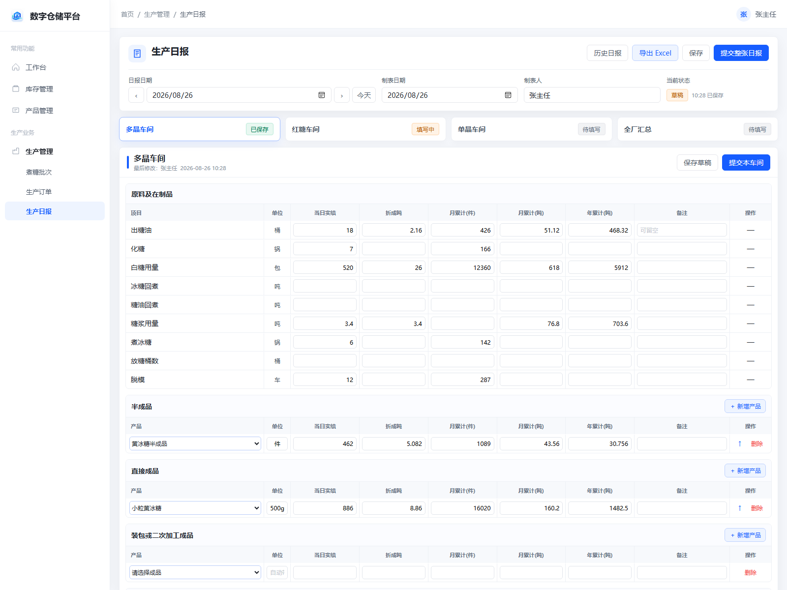

# 来冰公司生产日报——功能与页面确认稿

> 本文用于与甲方确认“生产日报”最终使用效果，不涉及数据库、接口或其他技术内容。
>
> 页面中的产品名称和数字均为演示示例，不代表真实生产数据。

## 一、建设目标

把目前使用 Excel 填写的生产日报搬到系统中，形成一张多人共享的电子日报。

完成后，有相应权限的人员可以：

- 查看任意日期的完整生产日报；
- 填写和修改多晶、红糖、单晶及全厂汇总数据；
- 根据当天实际生产情况增加、修改、删除产品行；
- 导入已有生产日报 Excel，直接形成系统日报；
- 将日报导出为 Excel，版式与现有样表保持一致。

## 二、页面效果



可直接打开并点击体验：[生产日报交互原型](原型/生产日报页面原型.html)

页面继续采用当前系统的蓝白色风格，页面标题统一显示为“生产日报”。生产日报只使用一个页面，不需要在多个功能之间来回切换。

正式页面只保留字段名称、数据、状态和操作按钮，不显示填写规则、权限规则或固定项目限制等说明性文字。

页面从上到下分为三部分：

1. 日报基本信息：日报日期、制表日期、制表人、当前状态及导入、导出按钮。
2. 车间切换区：多晶车间、红糖车间、单晶车间、全厂汇总。
3. 数据填写区：原料及在制品、产品、综合指标等内容。

页面不提供左右横向滚动。显示空间不足时，内容只会向下排列。

## 三、使用方式

### 1. 打开某一天的日报

用户点击一级菜单“生产日报”，选择需要填写的日期。

- 当天已有日报时，系统显示已保存内容；
- 当天还没有日报时，系统显示一张空白日报；
- 可以随时查看和补录以前日期的日报。

### 2. 填写基本信息

制表日期和制表人由用户自行填写，也可以留空。

日报不区分哪位用户只能填写哪个部门。只要甲方管理员给该用户配置了填写权限，该用户就可以填写整张日报。

### 3. 切换填写部门

页面上方提供四个明显的切换入口：

- 多晶车间；
- 红糖车间；
- 单晶车间；
- 全厂汇总。

每个部门显示保存状态和最后修改信息，方便多人共同填写时了解当前进度。

### 4. 保存和提交

每个部门可以单独保存，整张日报也可以统一提交。

- 没有必填项目，未填写的内容可以留空；
- 提交后仍然允许修改；
- 不设置审核、退回和锁定流程；
- 不限制历史日报的修改时间和修改次数。

## 四、产品填写方式

产品、半成品、直接成品以及装包或二次加工成品采用“产品行”方式填写。

用户可以：

- 点击“新增产品”增加一行；
- 从系统现有产品中选择成品或半成品；
- 修改已选择的产品；
- 删除不需要的产品行；
- 按住拖拽图标调整产品顺序；
- 让同一个产品出现在不同产品分区。

所有产品的单位统一显示为“件”，用户不需要填写或修改单位。

如果当天没有任何产品，页面和导出的 Excel 仍会保留一条空白产品行。

## 五、固定指标填写方式

原料及在制品、综合指标和全厂汇总严格按照现有样表提供固定项目。

- 固定项目不能增加、删除或改名；
- 固定单位不能修改；
- 每个数值都由用户手工填写；
- 系统不自动计算折成吨、小计、月累计、年累计、产率、结晶率、种子占比、单耗或全厂汇总；
- 空白和数字 0 分开处理：空白表示没有填写，0 表示用户明确填写了 0。

“冰糖结昌率”按本次确认修正为“冰糖结晶率”；“总用糖量（折白糖）”的单位继续保持“件”。

## 六、人员与权限

继续使用系统现有的用户、角色和权限管理，不增加车间人员配置功能。

甲方管理员可以给用户配置以下权限：

| 权限 | 用户可以做什么 |
|---|---|
| 查看生产日报 | 查看所有部门和全厂汇总 |
| 填写生产日报 | 新建、填写、修改和提交整张日报 |
| 导出生产日报 | 导出指定日期的 Excel |

导入 Excel 使用“填写生产日报”权限，不增加新的权限项目。

“部门”只作为日报中的内容分区，不用于限制人员能查看或填写哪些内容。

全厂汇总由厂长填写，但系统第一版不判断当前人员是否为厂长，由甲方管理员通过权限分配控制。

## 七、Excel 导入与导出

点击“导入 Excel”并选择已有生产日报后，系统读取表格中的日报日期、制表信息、四个车间的固定指标和产品行，一次性生成对应日期的系统日报。

- 导入前会要求用户确认；
- 导入会覆盖 Excel 所属日期的整张日报；
- 产品名称会按系统“产品管理”中的成品/半成品类型自动匹配；
- 无法自动匹配的产品会保留原 Excel 名称，并以红框和“未找到匹配产品”提示用户重新选择；
- 存在未匹配产品时先显示整表预览，不写入日报；全部选择完成并点击“保存导入”后才一次性保存整张日报；
- 用户可以取消待匹配的导入并恢复原日报，导入完成后也可以继续修改、保存或提交。

点击“导出 Excel”后，系统按照现有《来冰公司生产日报样表》生成文件。

导出规则：

- 保留多晶、红糖、单晶和全厂汇总四个区域；
- 保留样表中的固定项目、单位、说明、边框和打印方向；
- 按页面中的产品数量自动增加产品行；
- 没有产品时保留一条空白产品行；
- 制表人、制表日期和所有数值均使用用户已经保存的内容；
- 空值保持空白，数字 0 正常导出为 0；
- 不在导出时重新计算或改动用户填写的数字；
- 打印时固定为一页宽，不出现横向第二页；内容较多时允许向下分页。

## 八、典型操作流程

```text
甲方管理员分配权限
        ↓
用户选择日报日期，或直接导入已有 Excel
        ↓
填写或检查制表信息并切换对应车间
        ↓
填写固定指标、增加产品并填写数据
        ↓
保存草稿或提交日报
        ↓
需要时继续修改或导出 Excel
```

## 九、第一版不包含的功能

为尽快完成可用版本，第一版暂不包含：

- 自动读取生产订单、库存或其他业务数据；
- 自动计算小计、累计、产率、单耗和全厂汇总；
- 按车间或部门限制填写范围；
- 日报审核、退回和锁定；
- 提交后的修改期限；
- 手机端专门页面。

以后甲方明确提出计算公式、审核流程或自动取数要求时，可以在现有日报基础上继续增加。

## 十、请甲方重点确认

请结合页面原型确认以下内容：

- [ ] 页面采用一个入口、三个车间和一个全厂汇总分区的形式是否合适；
- [ ] 基本信息的位置和填写方式是否合适；
- [ ] 产品采用可新增、修改、删除和排序的行是否合适；
- [ ] 产品单位统一为“件”是否合适；
- [ ] 固定指标全部手工填写、不自动计算是否合适；
- [ ] 不设置必填、审核和提交后锁定是否合适；
- [ ] 三种操作权限是否满足人员管理需要；
- [ ] Excel 导入、导出和打印规则是否符合使用习惯。

以上内容确认后，再进入正式开发阶段。
