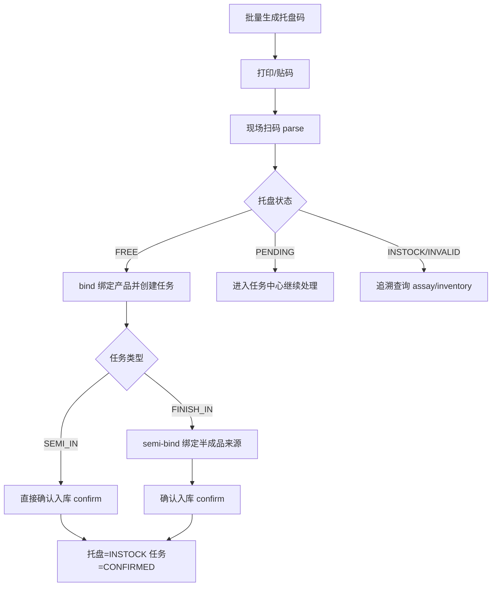
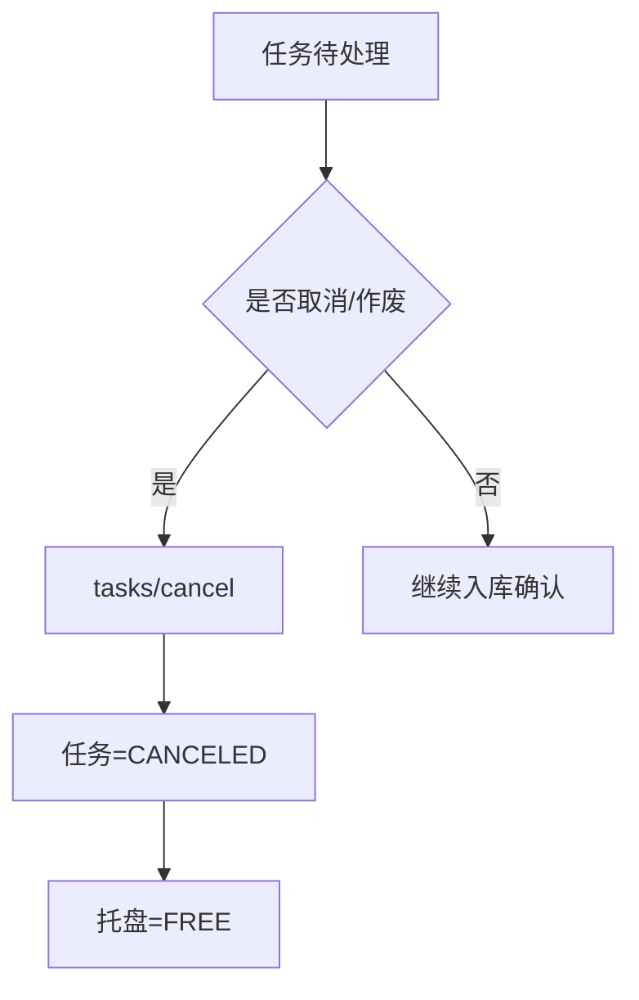
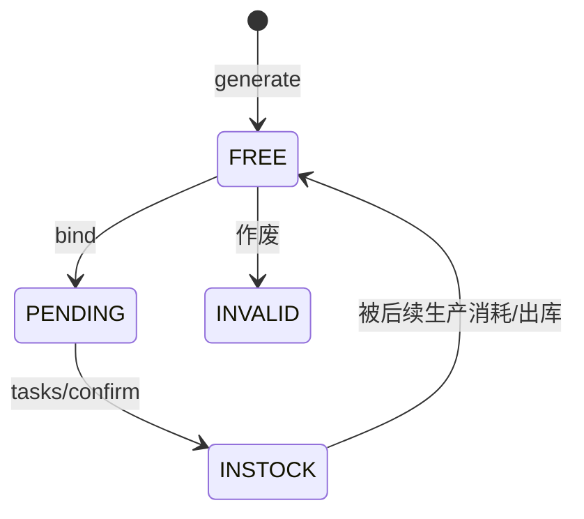
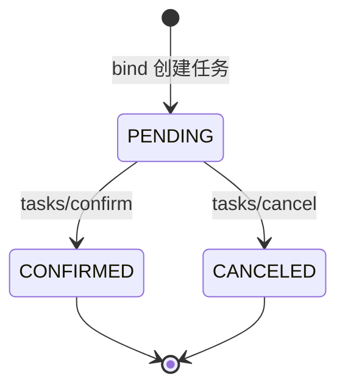

# 托盘码模块功能文档（API + 流程 + 状态机）

> 适用范围：`/api/pallet-codes` 相关接口。  
> 本文面向前后端联调、测试与实施。

---

## 1. 模块目标

托盘码模块用于建立“**二维码托盘**”的业务闭环：

1. 批量生成托盘码并打印二维码。
2. 扫码绑定产品，形成入库任务。
3. 对成品任务绑定半成品来源明细。
4. 批量确认入库，自动写入库存链路。
5. 支持托盘维度的查询与追溯（化验、库存位置）。

---

## 2. 统一约定

## 2.1 Base URL
- 本地：`http://localhost:8080`
- 路径前缀：`/api/pallet-codes`

## 2.2 鉴权
- 除公开文档未声明的特殊接口外，均需登录态（JWT）。
- 通常从 `@AuthenticationPrincipal LoginUser` 获取操作人。

## 2.3 统一响应格式

```json
{
  "code": 200,
  "msg": "success",
  "data": {}
}
```

- 成功：`code = 200`。
- 失败：`code != 200`，`msg` 为错误原因。

分页数据 `data` 结构：

```json
{
  "total": 123,
  "records": []
}
```

## 2.4 枚举字典

### 托盘状态 `pallet_code.status`
- `FREE`：空闲，可绑定。
- `PENDING`：已绑定，待入库。
- `INSTOCK`：已入库。
- `INVALID`：已作废。

说明：
- `CONSUMED` 不再作为托盘当前状态。
- 半成品消耗、成品出库都属于历史动作，完成后托盘应回到 `FREE`。

### 任务类型 `pallet_task.task_type`
- `SEMI_IN`：半成品入库任务。
- `FINISH_IN`：成品入库任务。
- `OUT`：二维码出库任务。
- `TRANSFER`：托盘二维码调拨任务。

### 任务业务场景 `pallet_task.biz_scene`
- `DIRECT_OUT`：半成品普通出库。
- `PREPARE_CONSUMED`：半成品转入备料池。
- `FINISH_OUT`：成品普通出库。

说明：
- `TRANSFER` 任务不使用 `biz_scene`，保持为空。

### 任务状态 `pallet_task.status`
- `PENDING`：待处理。
- `CONFIRMED`：已确认完成。
- `CANCELED`：已取消。

### 流转动作 `pallet_flow_record.operation_type`
- `SEMI_BIND`
- `ASSAY`
- `SEMI_INSTOCK`
- `FINISH_BIND`
- `FINISH_INSTOCK`
- `PREPARE_CONSUMED`
- `TRANSFER`
- `CONSUMED`
- `OUT`
- `CANCELED`

### 半成品备料池状态 `semi_prepare_pool.status`
- `ACTIVE`：仍在备料池中，等待最终消耗。
- `CONSUMED`：已确认消耗。
- `CANCELED`：已取消/失效。

### 循环复用字段
- `pallet_code.current_cycle_no`：托盘当前/最近一次循环号。
- `pallet_task.cycle_no`：任务所属循环号。
- `pallet_flow_record.cycle_no`：流转记录所属循环号。

### 单位
- `0`：板
- `1`：件

---

## 3. 接口清单（按业务阶段）

## 3.1 生成与管理托盘码

### 3.1.1 批量生成托盘码
- **URL**：`POST /api/pallet-codes/generate`
- **功能**：生成指定数量托盘码（每次 1~100）。
- **请求体**：

```json
{
  "count": 20
}
```

- **参数说明**：

| 字段 | 类型 | 必填 | 说明 |
|---|---|---|---|
| count | Integer | 是 | 生成数量，1~100 |

- **响应 data**：`string[]`（托盘码数组）

```json
{
  "code": 200,
  "msg": "success",
  "data": ["BT0A3ZK", "BT1FD98", "BT7P2QW"]
}
```

- **失败示例**：
  - `生成数量必须在1-100之间`

---

### 3.1.2 托盘码分页查询
- **URL**：`POST /api/pallet-codes`
- **功能**：托盘码管理页查询。
- **请求体**：

```json
{
  "code": "BT0A3ZK",
  "productName": "白冰糖A",
  "productType": "白冰糖",
  "productStatus": "成品",
  "productionDateStart": "2026-04-01",
  "productionDateEnd": "2026-04-08",
  "pageNum": 1,
  "pageSize": 10
}
```

- **参数说明**：

| 字段 | 类型 | 必填 | 说明 |
|---|---|---|---|
| code | String | 否 | 托盘码精确匹配 |
| productName | String | 否 | 产品名模糊匹配 |
| productType | String | 否 | 产品类型 |
| productStatus | String | 否 | 半成品/成品 |
| productionDateStart | LocalDate | 否 | 生产日期起 |
| productionDateEnd | LocalDate | 否 | 生产日期止 |
| pageNum | Long | 否 | 页码，默认 1 |
| pageSize | Long | 否 | 页大小，默认 10 |

- **响应 data**：`PageResult<PalletCodePageVO>`

`records` 单项字段：
`id, code, status, productName, productType, productStatus, productionDate, screenMeshName, assayId, createdAt, createdByName, updatedAt, updatedByName`

---

### 3.1.3 获取托盘二维码图片
- **URL**：`GET /api/pallet-codes/{code}/qrcode`
- **功能**：生成托盘码二维码 PNG（用于预览/打印）。
- **路径参数**：

| 字段 | 类型 | 必填 | 说明 |
|---|---|---|---|
| code | String | 是 | 托盘码 |

- **响应**：`image/png` 二进制图片。
- **失败示例**：
  - `托盘码格式非法`
  - `托盘码校验失败`
  - `托盘码不存在`

---

### 3.1.4 批量作废托盘码
- **URL**：`POST /api/pallet-codes/invalid`
- **功能**：将空闲托盘置为 `INVALID`。
- **请求体**：

```json
{
  "codes": ["BT0A3ZK", "BT1FD98"],
  "remark": "标签污染，重新制码"
}
```

- **参数说明**：

| 字段 | 类型 | 必填 | 说明 |
|---|---|---|---|
| codes | String[] | 是 | 托盘码列表，不能为空 |
| remark | String | 否 | 备注 |

- **响应 data**：`null`

---

## 3.2 扫码绑定与任务处理

### 3.2.1 扫码解析托盘码
- **URL**：`GET /api/pallet-codes/parse?code=BT0A3ZK`
- **功能**：校验并解析托盘码，返回基础信息。
- **查询参数**：

| 参数 | 类型 | 必填 | 说明 |
|---|---|---|---|
| code | String | 是 | 托盘码 |

- **响应 data**：`PalletCodeInfoVO`

字段：
`id, code, status, productName, productStatus, productionDate, screenMeshName, assayId, createdAt, createdBy, updatedAt, updatedBy`

---

### 3.2.2 绑定托盘并创建入库任务
- **URL**：`POST /api/pallet-codes/bind`
- **功能**：扫码后绑定产品信息，创建待入库任务（不处理化验数据）。
- **请求体**：

```json
{
  "code": "BT0A3ZK",
  "productId": 101,
  "productStatus": "成品",
  "productionDate": "2026-04-08",
  "quantity": 1,
  "unit": "0",
  "remark": "早班扫码绑定"
}
```

- **参数说明**：

| 字段 | 类型 | 必填 | 说明 |
|---|---|---|---|
| code | String | 是 | 扫码得到的托盘码 |
| productId | Integer | 是 | 产品ID |
| productStatus | String | 是 | `半成品` / `成品` |
| productionDate | LocalDate | 是 | 生产日期 |
| quantity | Integer | 否 | 数量（默认 1） |
| unit | String | 是 | `0` 板 / `1` 件 |
| remark | String | 否 | 备注 |

- **响应 data**：`PalletBindResultVO`

字段：
`palletCodeId, code, palletStatus, taskId, taskType, taskStatus, productId, productName, productType, productStatus, screenMeshId, screenMeshName, productionDate, createdAt, remark`

- **关键规则**：
  1. 托盘必须是 `FREE` 才能绑定。
  2. 同托盘不能已存在未完成任务。
  3. `productStatus=半成品` 时创建 `SEMI_IN`；`成品` 时创建 `FINISH_IN`。
  4. 绑定成功后托盘变为 `PENDING`。

---

### 3.2.3 托盘任务分页查询
- **URL**：`POST /api/pallet-codes/tasks/list`
- **功能**：任务中心列表查询。
- **请求体**：

```json
{
  "code": "BT0A3ZK",
  "taskType": "FINISH_IN",
  "status": "PENDING",
  "productName": "白冰糖A",
  "productType": "白冰糖",
  "productStatus": "成品",
  "productionDateStart": "2026-04-01",
  "productionDateEnd": "2026-04-08",
  "pageNum": 1,
  "pageSize": 10
}
```

- **响应 data**：`PageResult<PalletTaskPageVO>`

`records` 单项字段：
`taskId, taskType, bizScene, taskStatus, palletCodeId, code, targetWarehouseId, targetWarehouseName, targetSide, productId, productName, productType, productStatus, productionDate, screenMeshId, screenMeshName, hasSemiItems, semiItemCount, semiItems, assayId, createdBy, createdAt, confirmedBy, confirmedAt`

---

### 3.2.4 成品任务绑定半成品明细
- **URL**：`POST /api/pallet-codes/tasks/semi-bind`
- **功能**：给 `FINISH_IN + PENDING` 任务绑定半成品来源（全量覆盖）。
- **请求体**：

```json
{
  "code": "BT0A3ZK",
  "items": [
    {
      "semiPalletCode": "BT9H2TK",
      "quantity": 1,
      "unit": "0",
      "useAssay": true
    },
    {
      "semiPalletCode": "BT7P2QW",
      "quantity": 10,
      "unit": "1",
      "useAssay": false
    }
  ]
}
```

- **参数说明（items）**：

| 字段 | 类型 | 必填 | 说明 |
|---|---|---|---|
| semiPalletCode | String | 是 | 半成品托盘码 |
| quantity | Integer | 是 | 数量 |
| unit | String | 是 | `0` 板 / `1` 件 |
| useAssay | Boolean | 否 | 是否套用该条半成品的化验数据 |

- **响应 data**：`TaskSemiItemVO[]`

字段：
`id, semiPalletCode, semiProductId, semiProductName, productionDate, quantity, unit, useAssay`

- **关键规则**：
  1. 仅对成品待处理任务有效。
  2. 半成品托盘必须为“半成品”且状态为 `INSTOCK`。
  3. 半成品托盘当前轮次必须存在 `semi_prepare_pool.status = ACTIVE`。
  4. 未进入备料池的半成品托盘不能用于成品绑定。
  5. `useAssay=true` 仅允许 1 条。
  6. 提交是“全量覆盖”语义（不是增量追加）。

---

### 3.2.5 批量确认托盘入库
- **URL**：`POST /api/pallet-codes/tasks/confirm`
- **功能**：批量确认入库，按任务类型自动走半成品/成品链路。
- **请求体**：

```json
{
  "items": [
    {
      "code": "BT0A3ZK",
      "warehouseName": "A1",
      "entryDate": "2026-04-08",
      "side": "左",
      "quantity": 1,
      "unit": "0",
      "remark": "入库确认"
    }
  ]
}
```

- **参数说明（items）**：

| 字段 | 类型 | 必填 | 说明 |
|---|---|---|---|
| code | String | 是 | 托盘码 |
| warehouseName | String | 是 | 入库仓库名称 |
| entryDate | LocalDate | 否 | 入库日期，默认任务生产日期 |
| side | String | 否 | 左/右，默认左 |
| quantity | Integer | 否 | 默认 1 |
| unit | String | 否 | 默认 `0`（板） |
| remark | String | 否 | 备注 |

- **响应 data**：`InVO[]`

- **关键规则**：
  1. 托盘必须是 `PENDING`。
  2. 必须存在待处理任务。
  3. 成品任务绑定的半成品来源必须来自当前轮次 `ACTIVE` 备料池。
  4. 对来自备料池的半成品来源，只做合法性校验，不再重复扣减正常库存。
  5. 入库成功后：成品托盘 `INSTOCK`、任务 `CONFIRMED`、写入流转记录。
  6. 若为成品任务，则该任务绑定的半成品托盘会在同一事务内写入 `CONSUMED` 流转、将备料池记录改为 `CONSUMED`，并释放回 `FREE`。

---

### 3.2.6 批量取消入库任务
- **URL**：`POST /api/pallet-codes/tasks/cancel`
- **功能**：按托盘码取消当前轮次待处理入库任务，并释放托盘回 `FREE`。
- **请求体**：同 `invalid`

```json
{
  "codes": ["BT0A3ZK"],
  "remark": "工单取消"
}
```

- **响应 data**：`null`

- **结果说明**：
  - 相关任务改为 `CANCELED`
  - 托盘释放回 `FREE`

---

### 3.2.7 创建半成品普通出库任务
- **URL**：`POST /api/pallet-codes/semi/out/create`
- **功能**：扫码一个或多个半成品托盘码，创建 `OUT + DIRECT_OUT` 任务。
- **请求体**：

```json
{
  "codes": ["BT0A3ZK", "BT1FD98"],
  "remark": "客户直发"
}
```

- **响应 data**：`null`

- **关键规则**：
  1. 托盘必须存在，且当前状态为 `INSTOCK`。
  2. 仅允许半成品托盘。
  3. 托盘当前必须仍在正常库存中。
  4. 当前轮次不得存在未完成的 `OUT` 任务。
  5. 当前轮次不得存在 `ACTIVE` 备料池记录。
  6. 同一请求中不得重复扫码同一托盘。
  7. 创建任务阶段不释放托盘，托盘状态保持 `INSTOCK`。

---

### 3.2.8 确认半成品普通出库
- **URL**：`POST /api/pallet-codes/semi/out/confirm`
- **功能**：批量确认当前轮次 `OUT + DIRECT_OUT` 任务。
- **请求体**：

```json
{
  "codes": ["BT0A3ZK", "BT1FD98"],
  "remark": "车辆已出厂"
}
```

- **响应 data**：`null`

- **关键规则**：
  1. 必须命中当前轮次待确认的 `OUT + DIRECT_OUT` 任务。
  2. 确认时按 `pallet_code_id` 精确定位唯一库存记录并执行一次真实库存扣减。
  3. 写一条 `operation_type = OUT` 的托盘流转记录。
  4. 同一事务内释放托盘回 `FREE` 并清空当前绑定信息。
  5. 任务改为 `CONFIRMED`。

---

### 3.2.9 创建转入备料池任务
- **URL**：`POST /api/pallet-codes/semi/prepare/create`
- **功能**：扫码一个或多个半成品托盘码，创建 `OUT + PREPARE_CONSUMED` 任务。
- **请求体**：

```json
{
  "codes": ["BT0A3ZK", "BT1FD98"],
  "remark": "备料区A架第2层"
}
```

- **响应 data**：`null`

- **关键规则**：
  1. 托盘必须存在，且当前状态为 `INSTOCK`。
  2. 仅允许半成品托盘。
  3. 托盘当前必须仍在正常库存中。
  4. 当前轮次不得存在未完成的 `OUT` 任务。
  5. 当前轮次不得存在 `ACTIVE` 备料池记录。
  6. 同一请求中不得重复扫码同一托盘。
  7. 创建任务阶段不释放托盘，托盘状态保持 `INSTOCK`。

---

### 3.2.10 确认转入备料池
- **URL**：`POST /api/pallet-codes/semi/prepare/confirm`
- **功能**：批量确认当前轮次 `OUT + PREPARE_CONSUMED` 任务。
- **请求体**：

```json
{
  "codes": ["BT0A3ZK", "BT1FD98"],
  "remark": "已转入备料区"
}
```

- **响应 data**：`null`

- **关键规则**：
  1. 必须命中当前轮次待确认的 `OUT + PREPARE_CONSUMED` 任务。
  2. 确认时按托盘维度执行一次真实库存扣减，并写出库记录。
  3. 同一事务内创建一条 `semi_prepare_pool` 记录，状态为 `ACTIVE`。
  4. 写一条 `operation_type = PREPARE_CONSUMED`、`operation_name = 转入备料池` 的托盘流转记录。
  5. 托盘不释放，状态仍保持 `INSTOCK`。
  6. 任务改为 `CONFIRMED`。

---

### 3.2.11 确认半成品消耗
- **URL**：`POST /api/pallet-codes/semi/consume/confirm`
- **功能**：批量确认备料池中的半成品托盘已最终消耗。
- **请求体**：

```json
{
  "codes": ["BT0A3ZK", "BT1FD98"],
  "remark": "投料完成"
}
```

- **响应 data**：`null`

- **关键规则**：
  1. 每个托盘当前轮次必须存在一条 `semi_prepare_pool.status = ACTIVE` 记录。
  2. 托盘必须仍为 `INSTOCK`，且产品状态为半成品。
  3. 正常库存中不允许再存在该托盘的库存记录，否则直接报错。
  4. 确认消耗时不再写 `out_stock`，不再扣减正常库存。
  5. 同一事务内写 `operation_type = CONSUMED` 流转、将备料池记录改为 `CONSUMED`，并释放托盘回 `FREE`。

---

### 3.2.12 创建成品出库任务
- **URL**：`POST /api/pallet-codes/finish/out/create`
- **功能**：扫码一个或多个成品托盘码，创建 `OUT + FINISH_OUT` 任务。
- **请求体**：

```json
{
  "codes": ["BT0A3ZK", "BT1FD98"],
  "remark": "客户提货"
}
```

- **响应 data**：`null`

- **关键规则**：
  1. 托盘必须存在，且当前状态为 `INSTOCK`。
  2. 仅允许成品托盘。
  3. 当前正常库存里必须仍有该托盘的库存记录。
  4. 当前轮次不得存在未完成的 `OUT` 任务。
  5. 同一请求中不得重复扫码同一托盘。
  6. 创建阶段不扣减库存、不释放托盘，托盘状态保持 `INSTOCK`。

---

### 3.2.13 确认成品出库
- **URL**：`POST /api/pallet-codes/finish/out/confirm`
- **功能**：批量确认当前轮次 `OUT + FINISH_OUT` 任务。
- **请求体**：

```json
{
  "codes": ["BT0A3ZK", "BT1FD98"],
  "remark": "已装车出库"
}
```

- **响应 data**：`null`

- **关键规则**：
  1. 必须命中当前轮次待确认的 `OUT + FINISH_OUT` 任务。
  2. 确认时按托盘码精确找到唯一库存记录，并执行一次真实库存扣减。
  3. 写一条 `operation_type = OUT`、`operation_name = 成品出库` 的托盘流转记录。
  4. 同一事务内释放托盘回 `FREE` 并清空当前绑定信息。
  5. 任务改为 `CONFIRMED`。

---

### 3.2.14 创建托盘调拨任务
- **URL**：`POST /api/pallet-codes/transfer/create`
- **功能**：扫码一个或多个在库托盘码，创建 `TRANSFER` 调拨任务。
- **请求体**：

```json
{
  "items": [
    {
      "code": "BT0A3ZK",
      "targetWarehouseName": "A2",
      "targetSide": "左",
      "remark": "移至A2左侧"
    }
  ]
}
```

- **响应 data**：`null`

- **关键规则**：
  1. 适用于半成品托盘和成品托盘。
  2. 托盘必须存在，且当前状态为 `INSTOCK`。
  3. 当前正常库存中必须仍存在该托盘的 `inventory` 记录。
  4. 当前轮次不得存在未完成的 `TRANSFER` 任务。
  5. 当前轮次若已存在未完成的 `OUT` 任务，也不允许再创建调拨任务。
  6. 调拨任务使用 `task_type = TRANSFER`，`biz_scene` 为空。
  7. 创建阶段不移动库存、不释放托盘，托盘状态保持 `INSTOCK`。

---

### 3.2.15 确认托盘调拨
- **URL**：`POST /api/pallet-codes/transfer/confirm`
- **功能**：批量确认当前轮次 `TRANSFER` 任务。
- **请求体**：

```json
{
  "codes": ["BT0A3ZK"],
  "remark": "调拨完成"
}
```

- **响应 data**：`null`

- **关键规则**：
  1. 必须命中当前轮次待确认的 `TRANSFER` 任务。
  2. 不复用旧的产品/批次级调拨主链，而是按托盘码精确定位唯一库存记录。
  3. 确认时将该托盘对应的库存记录移动到目标仓库/目标侧分配出的新库位。
  4. 写一条 `operation_type = TRANSFER` 的托盘流转记录，并带上原库存位置与目标库存位置。
  5. 调拨完成后托盘状态仍为 `INSTOCK`，不释放托盘，不写 `OUT`。

---

## 3.3 追溯查询

### 3.3.1 查询托盘化验数据
- **URL**：`GET /api/pallet-codes/{code}/assay`
- **功能**：按托盘码查询化验信息；支持从任务/产品+日期回填化验关联。
- **响应 data**：`PalletAssayVO`

字段：
`productName, sampleDate, colorValue, reducingSugar, dryWeight, conductivityAsh, sucrose, insolubleImpurity, phValue, testerName, isQualified, qualifiedStandards, createdAt`

---

### 3.3.2 查询托盘库存位置
- **URL**：`GET /api/pallet-codes/{code}/inventory`
- **功能**：查询托盘当前所在库位。
- **响应 data**：`PalletInventoryVO`

字段：
`warehouseName, side, rowNumber, layer, quantity, unit, inStockTime`

说明：`unit=false` 表示板，`unit=true` 表示件。

---

## 4. 模块工作流程

## 4.1 主流程（扫码绑定到入库）



## 4.2 异常与中断流程



---

## 5. 状态变更说明

## 5.1 托盘状态机



## 5.2 任务状态机



## 5.3 关键动作与状态结果对照

| 动作 | 接口 | 托盘状态 | 任务状态 | 说明 |
|---|---|---|---|---|
| 生成托盘码 | `generate` | `FREE` | - | 初始可绑定 |
| 绑定并建任务 | `bind` | `PENDING` | `PENDING` | 任务类型由产品状态决定 |
| 成品绑定半成品 | `tasks/semi-bind` | 不变 | 不变 | 更新任务来源明细 |
| 确认入库 | `tasks/confirm` | `INSTOCK` | `CONFIRMED` | 成品任务会额外将绑定的半成品托盘写 `CONSUMED` 并释放 |
| 创建半成品普通出库任务 | `semi/out/create` | `INSTOCK` | `PENDING` | 创建 `OUT + DIRECT_OUT` 任务 |
| 确认半成品普通出库 | `semi/out/confirm` | `FREE` | `CONFIRMED` | 扣减正常库存、写 `OUT`、释放托盘 |
| 创建转入备料池任务 | `semi/prepare/create` | `INSTOCK` | `PENDING` | 创建 `OUT + PREPARE_CONSUMED` 任务 |
| 确认转入备料池 | `semi/prepare/confirm` | `INSTOCK` | `CONFIRMED` | 扣减正常库存、写 `PREPARE_CONSUMED`、新增 `ACTIVE` 备料池记录 |
| 确认半成品消耗 | `semi/consume/confirm` | `FREE` | - | 不重复扣库存，写 `CONSUMED`、备料池记录改为 `CONSUMED` |
| 创建成品出库任务 | `finish/out/create` | `INSTOCK` | `PENDING` | 创建 `OUT + FINISH_OUT` 任务 |
| 确认成品出库 | `finish/out/confirm` | `FREE` | `CONFIRMED` | 扣减成品库存、写 `OUT`、释放托盘 |
| 创建托盘调拨任务 | `transfer/create` | `INSTOCK` | `PENDING` | 创建 `TRANSFER` 任务，不改变托盘状态 |
| 确认托盘调拨 | `transfer/confirm` | `INSTOCK` | `CONFIRMED` | 移动库存位置、写 `TRANSFER`、托盘保持在库 |
| 作废托盘 | `invalid` | `INVALID` | - | 仅托盘状态为FREE时可执行 |
| 取消任务 | `tasks/cancel` | `FREE` | `CANCELED` | 取消当前轮次待处理任务并清理绑定信息 |

## 5.4 循环复用规则

1. 新生成托盘码时，`current_cycle_no = 0`。
2. 每次从 `FREE` 绑定进入 `PENDING` 时，先将 `current_cycle_no + 1`，并把该值写入本轮 `pallet_task.cycle_no` 与 `pallet_flow_record.cycle_no`。
3. 托盘释放回 `FREE` 时，保留 `current_cycle_no` 不变，不回退、不清零。
4. 当前轮次待处理任务查询，默认使用 `pallet_code.current_cycle_no` 过滤，避免历史 task/flow 与新一轮混淆。

---

## 6. 联调建议

1. **前端先做字典统一**：状态/单位统一 map，避免硬编码散落。
2. **提交前预校验**：
   - `useAssay=true` 只能 1 条；
   - `quantity > 0`；
   - 生产日期/入库日期格式正确。
3. **错误提示统一**：直接透传后端 `msg`，尤其是状态类错误（如“仅允许 FREE 绑定”）。
4. **流程页建议按状态分流**：`FREE` 走绑定，`PENDING` 走任务处理，其他走追溯只读。

---

## 7. 常见错误码/报错（示例）

> 当前模块业务异常多通过 `Result.error(code, msg)` 返回，以下为常见 `msg`：

- `托盘码格式非法`
- `托盘码校验失败`
- `托盘码不存在`
- `托盘当前状态不可绑定（仅允许 FREE 状态绑定）`
- `该托盘已存在未完成的入库任务`
- `未找到待处理的成品入库任务`
- `仅允许一条明细使用化验数据`
- `找不到化验数据`
- `当前托盘状态不支持入库确认`
